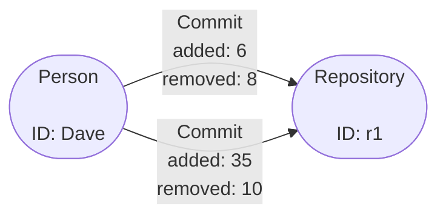

# Aggregation Guide

A basic introduction to the concept of Aggregation in Gaffer can be found in the
[User Guide](../user-guide/gaffer-basics/what-is-aggregation.md). This guide is
an extension of the introduction to demonstrate more advanced usage of
Aggregation and how it can be applied.

## Ingest Aggregation

Ingest aggregation permanently aggregates similar elements together in the Graph as
they are loaded. The application of ingest aggregation is done via the Graph schema
which will apply the aggregation if one of the following conditions are met:

- An entity has the same `group`, `vertex` (e.g. ID), `visibility` and all `groupBy`
  property values are the same.
- An edge has the same `group`, `source`, `destination`, and all `groupBy`
  property values are the same.

There are a few different use cases for applying ingest aggregation but it is
largely driven by the data you have and the analysis you wish to perform. As an
example, say you were expecting multiple connections of the same edge between
two nodes but each instance of the edge may have differing values on it's
properties this could be a place to apply aggregation to sum the values etc.

We can expand on that use case to create and example schema for a graph like
the following:



As you can see we have two vertex types, `Person` and `Repository` both without
any properties then, we have one edge type `Commit` with two properties `added`
and `removed`. Translating this into a basic Gaffer schema gives the following:

=== "elements.json"

    ```json
    {
        "edges": {
            "Commit": {
                "source": "id.person.string",
                "destination": "id.repo.string",
                "directed": "true",
                "properties": {
                    "added": "property.integer",
                    "removed": "property.integer"
                }
            }
        },
        "entities": {
            "Person": {
                "description": "Entity representing a person vertex",
                "vertex": "id.person.string"
            },
            "Software": {
                "description": "Entity representing a repository vertex",
                "vertex": "id.repo.string"
            }
        }
    }
    ```

=== "types.json"

    ```json
    {
        "types": {
            "id.person.string": {
                "description": "A basic type to hold the string id of a person entity",
                "class": "java.lang.String"
            },
            "id.repo.string": {
                "description": "A basic type to hold the string id of a repository entity",
                "class": "java.lang.String"
            },
            "property.integer": {
                "description": "A basic type to hold integer properties of elements",
                "class": "java.lang.Integer",
                "aggregateFunction": {
                    "class": "uk.gov.gchq.koryphe.impl.binaryoperator.Sum"
                }
            },
            "true": {
                "description": "A simple boolean that must always be true.",
                "class": "java.lang.Boolean",
                "validateFunctions": [
                    {
                        "class": "uk.gov.gchq.koryphe.impl.predicate.IsTrue"
                    }
                ]
            }
        }
    }
    ```
