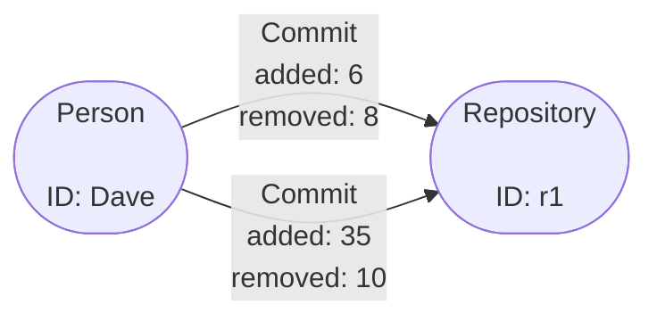

# Ingest Aggregation Example

## Simple Aggregation

To demonstrate basic aggregation at ingest we can take the following graph as a
start point and modify the schema so that the properties are summed together:



As you can see we have two vertex types, `Person` and `Repository` both without
any properties then, we have one edge type `Commit` with two properties `added`
and `removed`. Translating this into a basic Gaffer schema gives the following:

!!! note
    In Gaffer every property type defined in the schema must specify an
    `"aggregationFunction"` unless you specify `"aggregate": "false"` on the type.

=== "elements.json"

    ```json
    {
        "edges": {
            "Commit": {
                "source": "id.person.string",
                "destination": "id.repo.string",
                "directed": "true",
                "properties": {
                    "added": "property.integer",
                    "removed": "property.integer"
                }
            }
        },
        "entities": {
            "Person": {
                "description": "Entity representing a person vertex",
                "vertex": "id.person.string"
            },
            "Repository": {
                "description": "Entity representing a repository vertex",
                "vertex": "id.repo.string"
            }
        }
    }
    ```

=== "types.json"

    ```json
    {
        "types": {
            "id.person.string": {
                "description": "A basic type to hold the string id of a person entity",
                "class": "java.lang.String"
            },
            "id.repo.string": {
                "description": "A basic type to hold the string id of a repository entity",
                "class": "java.lang.String"
            },
            "property.integer": {
                "description": "A basic type to hold integer properties of elements",
                "class": "java.lang.Integer",
                "aggregateFunction": {
                    "class": "uk.gov.gchq.koryphe.impl.binaryoperator.Sum"
                }
            },
            "true": {
                "description": "A simple boolean that must always be true.",
                "class": "java.lang.Boolean",
                "validateFunctions": [
                    {
                        "class": "uk.gov.gchq.koryphe.impl.predicate.IsTrue"
                    }
                ]
            }
        }
    }
    ```

In the above schema you can see we have applied an aggregation function to the
`"property.integer"` type which will sum the property to give a total. For this
function we must specify a class that will do the aggregation. There exists a
few default classes and some additional ones implemented by the Koryphe module
which you can read more about in the [reference guide](../../reference/binary-operators-guide/binary-operators.md).

!!! tip
    It is possible to create your own aggregation functions however, they must
    extend the [`java.util.function.BiFunction`](https://docs.oracle.com/en/java/javase/11/docs/api/java.base/java/util/function/BiFunction.html?is-external=true)
    interface.

Loading the data into a Graph using the example schema we can form the Graph
and see the aggregation in action. First loading the data via the REST API
using the `AddElements` operation like below:

```json
{
    "class": "AddElements",
    "input": [
        {
            "class": "Edge",
            "group": "Commit",
            "source": "Dave",
            "destination": "r1",
            "directed": true,
            "properties": {
                "added": 6,
                "removed": 8
            }
        },
        {
            "class": "Edge",
            "group": "Commit",
            "source": "Dave",
            "destination": "r1",
            "directed": true,
            "properties": {
                "added": 35,
                "removed": 10
            }
        },
        {
            "class": "Entity",
            "group": "Person",
            "vertex": "Dave"
        },
        {
            "class": "Entity",
            "group": "Repository",
            "vertex": "r1"
        }
    ]
}
```

Now running a query on these elements with the seed as `"Dave"` you can see
that all the commit edges have been aggregated together to give a total
for the `added` and `removed` properties.

=== "JSON Query"

    ```json
    {
        "class": "GetElements",
        "input": [
            {
                "class": "EntitySeed",
                "vertex": "Dave"
            }
        ]
    }
    ```

=== "Result"

    ```json
    [
        {
            "class": "uk.gov.gchq.gaffer.data.element.Entity",
            "group": "Person",
            "vertex": "Dave",
            "properties": {}
        },
        {
            "class": "uk.gov.gchq.gaffer.data.element.Edge",
            "group": "Commit",
            "source": "Dave",
            "destination": "r1",
            "directed": true,
            "matchedVertex": "SOURCE",
            "properties": {
                "removed": 18,
                "added": 41
            }
        }
    ]
    ```

### Using the groupBy field

It is also possible to have a fine control over exactly when aggregation is
applied to by using the `groupBy` parameter. This parameter can be added to
the schema so that aggregation is applied only when a specific property is the
same between elements.

To demonstrate this functionality we can expand the example from the previous
section to add a new property to the `Commit` edge called `issue` which
hypothetically represents the issue number the commit relates to.

Now we can add the `groupBy` parameter to the schema so that all `Commit` edges
with the same `issue` property will be aggregated like before to sum the
`removed` and `added` properties:

```json
"edges": {
    "Commit": {
        "source": "id.person.string",
        "destination": "id.repo.string",
        "directed": "true",
        "properties": {
            "added": "property.integer",
            "removed": "property.integer",
            "issue": "property.integer"
        },
        "groupBy": [
            "issue"
        ]
    }
}
```

Now say if we added the following element to the graph and run a query to get the
edges like before:

=== "AddElements"

    ```json
    {
        "class": "AddElements",
        "input": [
            {
                "class": "Edge",
                "group": "Commit",
                "source": "Dave",
                "destination": "r1",
                "directed": true,
                "properties": {
                    "added": 20,
                    "removed": 5,
                    "issue": 1
                }
            },
            {
                "class": "Edge",
                "group": "Commit",
                "source": "Dave",
                "destination": "r1",
                "directed": true,
                "properties": {
                    "added": 6,
                    "removed": 8,
                    "issue": 1
                }
            },
            {
                "class": "Edge",
                "group": "Commit",
                "source": "Dave",
                "destination": "r1",
                "directed": true,
                "properties": {
                    "added": 60,
                    "removed": 4,
                    "issue": 2
                }
            },
            {
                "class": "Edge",
                "group": "Commit",
                "source": "Dave",
                "destination": "r1",
                "directed": true,
                "properties": {
                    "added": 35,
                    "removed": 10,
                    "issue": 2
                }
            },
            {
                "class": "Entity",
                "group": "Person",
                "vertex": "Dave"
            },
            {
                "class": "Entity",
                "group": "Repository",
                "vertex": "r1"
            }
        ]
    }
    ```

=== "Result"

    ```json
    [
        {
            "class": "uk.gov.gchq.gaffer.data.element.Entity",
            "group": "Person",
            "vertex": "Dave",
            "properties": {}
        },
        {
            "class": "uk.gov.gchq.gaffer.data.element.Edge",
            "group": "Commit",
            "source": "Dave",
            "destination": "r1",
            "directed": true,
            "matchedVertex": "SOURCE",
            "properties": {
                "issue": 1,
                "removed": 13,
                "added": 26
            }
        },
        {
            "class": "uk.gov.gchq.gaffer.data.element.Edge",
            "group": "Commit",
            "source": "Dave",
            "destination": "r1",
            "directed": true,
            "matchedVertex": "SOURCE",
            "properties": {
                "issue": 2,
                "removed": 14,
                "added": 95
            }
        }
    ]
    ```

As you can see we end up with two `Commit` edges relating to each `issue` with
all other properties aggregated together.

## Expanded Example

The example from the first section is a good demonstration of how aggregation
works but just having the total number of some properties may not be the most
useful. To demonstrate a more complex use case we will modify the example to add
some new properties to the edges so that after aggregation we'll have a graph like:


What we are doing with this graph is aggregating any new `Commit` edges so that
the `first` and `latest` commit dates are kept updated as new edges are added to
the Graph whilst, incrementing a `count` property to indicate overall how many
`Commit` edges are between two vertexes.

We will modify the schema from the basic example add the different properties
and set up the aggregation functions:

!!! tip
    For good practice we have also added some `validateFunctions` to give
    minimum confidence in the values of the types. Please see the
    [predicates reference guide](../../reference/predicates-guide/gaffer-predicates.md)
    for more information.

=== "elements.json"

    ```json
    {
        "edges": {
            "Commit": {
                "source": "id.person.string",
                "destination": "id.repo.string",
                "directed": "true",
                "properties": {
                    "first": "property.date.first",
                    "latest": "property.date.latest",
                    "count": "property.integer.count"
                }
            }
        },
        "entities": {
            "Person": {
                "description": "Entity representing a person vertex",
                "vertex": "id.person.string"
            },
            "Repository": {
                "description": "Entity representing a repository vertex",
                "vertex": "id.repo.string"
            }
        }
    }
    ```

=== "types.json"

    ```json
    {
        "types": {
            "id.person.string": {
                "description": "A basic type to hold the string id of a person entity",
                "class": "java.lang.String"
            },
            "id.repo.string": {
                "description": "A basic type to hold the string id of a repository entity",
                "class": "java.lang.String"
            },
            "property.integer.count": {
                "description": "A basic type to hold a count property that must be greater than 0",
                "class": "java.lang.Integer",
                "aggregateFunction": {
                    "class": "uk.gov.gchq.koryphe.impl.binaryoperator.Sum"
                },
                "validateFunctions": [
                    {
                        "class": "uk.gov.gchq.koryphe.impl.predicate.IsMoreThan",
                        "orEqualTo": true,
                        "value": 0
                    }
                ]
            },
            "property.date.first": {
                "description": "A Date type to hold first date property after aggregation",
                "class": "java.util.Date",
                "aggregateFunction": {
                    "class": "uk.gov.gchq.koryphe.impl.binaryoperator.Min"
                },
                "validateFunctions": [
                    {
                        "class": "uk.gov.gchq.koryphe.impl.predicate.Exists"
                    }
                ]
            },
            "property.date.latest": {
                "description": "A Date type to hold latest date property after aggregation",
                "class": "java.util.Date",
                "aggregateFunction": {
                    "class": "uk.gov.gchq.koryphe.impl.binaryoperator.Max"
                },
                "validateFunctions": [
                    {
                        "class": "uk.gov.gchq.koryphe.impl.predicate.Exists"
                    }
                ]
            },
            "true": {
                "description": "A simple boolean that must always be true.",
                "class": "java.lang.Boolean",
                "validateFunctions": [
                    {
                        "class": "uk.gov.gchq.koryphe.impl.predicate.IsTrue"
                    }
                ]
            }
        }
    }
    ```

As you can see in the types schema we have applied the `Min` function to the
`property.date.first` type so that will always be aggregated to be the
earliest date property. Similarly we apply the `Max` function to the
`property.date.latest` to always give us the latest date property. The
`property.integer.count` property keeps the simple `Sum` function to keep a
total of the number of edges.

Applying these schemas to a Graph we can then add the following elements to
demonstrate the aggregation in practice:

!!! note
    The dates here are in milliseconds since the Unix Epoch due to how
    Jackson serialises `java.util.Date` types.

```json
{
    "class": "AddElements",
    "input": [
        {
            "class": "Edge",
            "group": "Commit",
            "source": "Dave",
            "destination": "r1",
            "directed": true,
            "properties": {
                "first": {
                    "java.util.Date": 1451044800146
                },
                "latest": {
                    "java.util.Date": 1451044800146
                },
                "count": 1
            }
        },
        {
            "class": "Edge",
            "group": "Commit",
            "source": "Dave",
            "destination": "r1",
            "directed": true,
            "properties": {
                "first": {
                    "java.util.Date": 1514808000146
                },
                "latest": {
                    "java.util.Date": 1514808000146
                },
                "count": 1
            }
        },
        {
            "class": "Edge",
            "group": "Commit",
            "source": "Dave",
            "destination": "r1",
            "directed": true,
            "properties": {
                "first": {
                    "java.util.Date": 1672574400146
                },
                "latest": {
                    "java.util.Date": 1672574400146
                },
                "count": 1
            }
        },
        {
            "class": "Entity",
            "group": "Person",
            "vertex": "Dave"
        },
        {
            "class": "Entity",
            "group": "Repository",
            "vertex": "r1"
        }
    ]
}
```

!!! tip
    Loading the elements like this is just for demonstration purposes, it can
    look a little unintuitive as we have the same data for `first` and `latest`
    properties. In production you may want to create a custom
    `ElementsGenerator` so that the elements are created correctly from your raw
    data based on the graph schema.

Now running a query on these elements with the seed as `"Dave"` we can see that
we get back one edge with aggregated properties holding the `first` and `latest`
commit times as well as a `count` with the current number of edges.

=== "JSON Query"

    ```json
    {
        "class": "GetElements",
        "input": [
            {
                "class": "EntitySeed",
                "vertex": "Dave"
            }
        ]
    }
    ```

=== "Result"

    ```json
    [
        {
            "class": "uk.gov.gchq.gaffer.data.element.Entity",
            "group": "Person",
            "vertex": "Dave",
            "properties": {}
        },
        {
            "class": "uk.gov.gchq.gaffer.data.element.Edge",
            "group": "Commit",
            "source": "Dave",
            "destination": "r1",
            "directed": true,
            "matchedVertex": "SOURCE",
            "properties": {
                "count": 3,
                "first": {
                    "java.util.Date": 1451044800146
                },
                "latest": {
                    "java.util.Date": 1672574400146
                }
            }
        }
    ]
    ```

