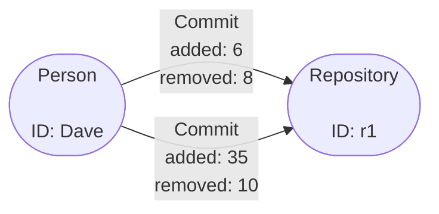
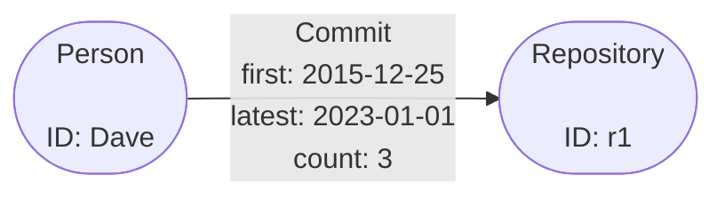

# Ingest Aggregation Example

## Simple Aggregation

To demonstrate basic aggregation at ingest we can take the following graph as a
start point and modify the schema so that the properties are summed together:



As you can see we have two vertex types, `Person` and `Repository` both without
any properties then, we have one edge type `Commit` with two properties `added`
and `removed`. Translating this into a basic Gaffer schema gives the following:

=== "elements.json"

    ```json
    {
        "edges": {
            "Commit": {
                "source": "id.person.string",
                "destination": "id.repo.string",
                "directed": "true",
                "properties": {
                    "added": "property.integer",
                    "removed": "property.integer"
                }
            }
        },
        "entities": {
            "Person": {
                "description": "Entity representing a person vertex",
                "vertex": "id.person.string"
            },
            "Repository": {
                "description": "Entity representing a repository vertex",
                "vertex": "id.repo.string"
            }
        }
    }
    ```

=== "types.json"

    ```json
    {
        "types": {
            "id.person.string": {
                "description": "A basic type to hold the string id of a person entity",
                "class": "java.lang.String"
            },
            "id.repo.string": {
                "description": "A basic type to hold the string id of a repository entity",
                "class": "java.lang.String"
            },
            "property.integer": {
                "description": "A basic type to hold integer properties of elements",
                "class": "java.lang.Integer",
                "aggregateFunction": {
                    "class": "uk.gov.gchq.koryphe.impl.binaryoperator.Sum"
                }
            },
            "true": {
                "description": "A simple boolean that must always be true.",
                "class": "java.lang.Boolean",
                "validateFunctions": [
                    {
                        "class": "uk.gov.gchq.koryphe.impl.predicate.IsTrue"
                    }
                ]
            }
        }
    }
    ```

In Gaffer every property type defined in the schema must specify an
`"aggregationFunction"` unless you specify `"aggregate": "false"` on the type.

In the above schema you can see we have applied an aggregation function to the
`"property.integer"` type which will sum the property to give a total. For this
function we must specify a class that will do the aggregation. There exists a
few default classes and some additional ones implemented by the Koryphe module
which you can read more about in the [reference guide](../reference/binary-operators-guide/binary-operators.md).

!!! tip
    It is possible to create your own aggregation functions however, they must
    extend the [`java.util.function.BiFunction`](https://docs.oracle.com/en/java/javase/11/docs/api/java.base/java/util/function/BiFunction.html?is-external=true)
    interface.

Loading the data into a Graph using the example schema we can form the Graph
and see the aggregation in action. First loading the data via the REST API
using the `AddElements` operation like below:

```json
{
    "class": "AddElements",
    "input": [
        {
            "class": "Edge",
            "group": "Commit",
            "source": "Dave",
            "destination": "r1",
            "directed": true,
            "properties": {
                "added": 6,
                "removed": 8
            }
        },
        {
            "class": "Edge",
            "group": "Commit",
            "source": "Dave",
            "destination": "r1",
            "directed": true,
            "properties": {
                "added": 35,
                "removed": 10
            }
        },
        {
            "class": "Entity",
            "group": "Person",
            "vertex": "Dave"
        },
        {
            "class": "Entity",
            "group": "Repository",
            "vertex": "r1"
        }
    ]
}
```

Now running a query on these elements with the seed as `"Dave"` you can see
that all the commit edges have been aggregated together to give a total
for the `added` and `removed` properties.

=== "JSON Query"

    ```json
    {
        "class": "GetElements",
        "input": [
            {
                "class": "EntitySeed",
                "vertex": "Dave"
            }
        ]
    }
    ```

=== "Result"

    ```json
    [
        {
            "class": "uk.gov.gchq.gaffer.data.element.Entity",
            "group": "Person",
            "vertex": "Dave",
            "properties": {}
        },
        {
            "class": "uk.gov.gchq.gaffer.data.element.Edge",
            "group": "Commit",
            "source": "Dave",
            "destination": "r1",
            "directed": true,
            "matchedVertex": "SOURCE",
            "properties": {
                "removed": 18,
                "added": 41
            }
        }
    ]
    ```

## Advanced Use Cases

The example from the first section is a good demonstration of how aggregation
works but just having the total number of some properties may not be the most
useful. To demonstrate a more complex use case we will modify the example to add
some new properties to the edges so that after aggregation we have a graph like:



What we are doing with this graph is aggregating any new `Commit` edges so that
the `first` and `latest` commit dates are kept updated as new edges are added to
the Graph whilst, incrementing a `count` property to indicate overall how many
`Commit` edges are between two vertexes.
