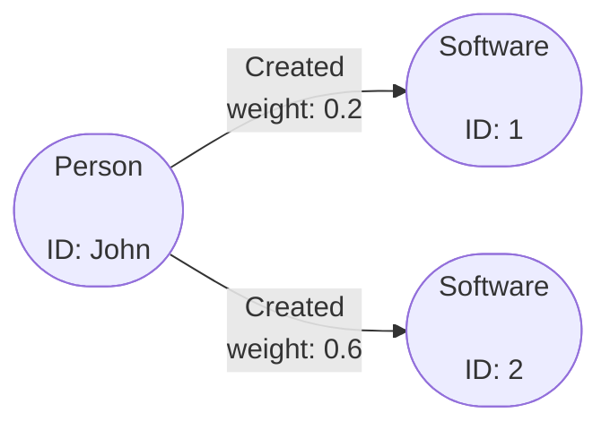

# Delete Elements Operation

In Gaffer 2.X a DeleteElements operation was added to allow users
to delete specific elements from their graph instance.

!!! warning
    Deleting elements is not reversible. Use of this operation should be
    limited and users should run test a Operation Chain which extracts any elements
    to be deleted prior to running any delete operations.

We will use the following graph to demonstrate how to delete elements from a
Gaffer graph.



To delete elements from a graph, users can simply add a `DeleteElements.Builder` to their
Operation Chain. This will take as its input the output of any operations run prior to it.


!!! example ""
    If a user gets the edge between John and Software 2 in a query and follows this
    up with a delete, then this edge will be removed leaving the three entities and a single edge.

    === "Java"

        ```java
            final OperationChain<Void> deleteElementsChain = new OperationChain.Builder()
                .first(new GetElements.Builder()
                    .input(new EdgeSeed("John", "2", DirectedType.EITHER))
                    .view(new View.Builder().edge("created").build())
                    .build())
                .then(new DeleteElements())
                .build();

            graph.execute(deleteElementsChain, new User());
        ```

    === "JSON"

        ```json
        {
            "class" : "OperationChain",
            "operations" : [{
                "class": "GetElements",
                "input": [{
                    "class": "EdgeSeed",
                    "source": "John",
                    "destination": "2",
                    "directedType": "EITHER"
                }],
                "view": {
                    "edges": "created"
                }
            },
            {
                "class" : "DeleteElements"
            }]
        }
        ```

    === "Python"

        ```python
        g.OperationChain(
            operations=[
                g.GetElements(
                    input = [g.EdgeSeed(source="John", destination="2", directedType="Either")]
                    view = g.ElementDefinition(group = "created")
                ),
                g.DeleteElements()
            ]
        )
        ```

    Results:
        ```JSON
            Entity[vertex="John",group="person"]
            Edge[source="John",destination="1",directed=true,matchedVertex=SOURCE,group="created",properties=Properties[weight=<java.lang.Float>0.2]]
            Entity[vertex="1",group="software"]
            Entity[vertex="2",group="software"]
        ```

If a user wishes to remove an entity and its associated edges, this is done by
querying for that entity with no filters.

!!! example ""
    If a user gets the John entity in a query and follows this up with a delete,
    then the John entity is removed and so are the edges for John -created-> 1
    and John-created-> 2.

    === "Java"

        ```java
            final OperationChain<Void> deleteElementsChain = new OperationChain.Builder()
                .first(new GetElements.Builder()
                    .input(new EntitySeed("John"))
                    .build())
                .then(new DeleteElements())
                .build();

            graph.execute(deleteElementsChain, new User());
        ```

    === "JSON"

        ```json
            {
                "class" : "OperationChain",
                "operations" : [{
                    "class": "GetElements",
                    "input": [{
                        "class": "EntitySeed",
                        "vertex": "John"
                    }]
                },
                {
                    "class" : "DeleteElements"
                }
            ]
        }
        ```

    === "Python"

        ```python
        g.OperationChain(
            operations=[
                g.GetElements(
                    input = [g.EntitySeed(vertex="John")]
                ),
                g.DeleteElements()
            ]
        )
        ```

    Results:
        ```JSON
            Entity[vertex="1",group="software"]
            Entity[vertex="2",group="software"]
        ```

If a user wishes to remove an entity but leave any associated, this is done by
querying for that entity with a filter.

!!! example ""
    If a user gets the John entity in a query but uses a `View` that filters for just entities, then the
    delete will leave the associated edges and only delete the John entity.

    === "Java"

        ```java
            final OperationChain<Void> deleteElementsChain = new OperationChain.Builder()
                .first(new GetElements.Builder()
                    .input(new EntitySeed("John"))
                    .view(new View.Builder().entity("person").build())
                    .build())
                .then(new DeleteElements())
                .build();

            graph.execute(deleteElementsChain, new User());
        ```

    === "JSON"

        ```json
            {
                "class" : "OperationChain",
                "operations" : [{
                    "class": "GetElements",
                    "input": [{
                        "class": "EntitySeed",
                        "vertex": "John"
                    }],
                    "view": {
                        "entities": "person"
                    }
                },
                {
                    "class" : "DeleteElements"
                }
            ]
        }
        ```

    === "Python"

        ```python
        g.OperationChain(
            operations=[
                g.GetElements(
                    input = [g.EdgeSeed(source="John", destination="2", directedType="Either")]
                    view = g.ElementDefinition(group = "person")
                ),
                g.DeleteElements()
            ]
        )
        ```

    Results:
        ```JSON
            Edge[source="John",destination="1",directed=true,matchedVertex=SOURCE,group="created",properties=Properties[weight=<java.lang.Float>0.2]]
            Edge[source="John",destination="2",directed=true,matchedVertex=SOURCE,group="created",properties=Properties[weight=<java.lang.Float>0.6]]
            Entity[vertex="1",group="software"]
            Entity[vertex="2",group="software"]
        ```
