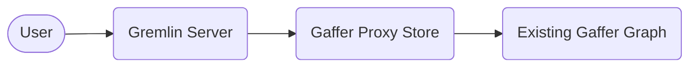

# Connecting Gremlin to Gaffer

It is possible to use Gremlin as an alternative querying language in Gaffer. To
make Gremlin available however, there are some additional steps that need to be
taken to connect to a Gaffer graph via this interface.

## Overview

Gremlin serves as a query layer for a graph that implements the Tinkerpop graph
structure. As of v2.1.0 Gaffer has made available a library that can be utilised
to enable Gremlin queries. This library can be included via maven in any project
using the following dependency definition:

```xml
<dependency>
    <groupId>uk.gov.gchq.gaffer</groupId>
    <artifactId>tinkerpop</artifactId>
    <version>${gaffer.version}</version>
</dependency>
```

The library contains the graph implementation that allows Tinkerpop to talk to a
Gaffer graph and generally is all that is needed to provide the functionality.
To actually utilise Gremlin queries however, a connection to whats known as a
`GraphTraversalSource` is required which is the class from which Gremlin
traversals are spawned. To do this we recommend utilising the provided
[Gremlin server framework](https://tinkerpop.apache.org/docs/current/reference/#connecting-gremlin-server)
which can be configured to use the Gaffer Tinkerpop implementation so that a
endpoint is available for Gremlin queries.

!!! note
    For release of Gaffer v2.2.0 a ready made container image will be provided
    to run a preconfigured Gremlin server for Gaffer.

## Connecting to Any Existing Gaffer Graph

The simplest way to connect Gremlin to an existing Gaffer graph where you may
not know the Store type or Schema would be via a [Proxy Store](../gaffer-stores/proxy-store.md).
Connecting this way means Gremlin communicates via the Gaffer graph's REST API
(similar to [gafferpy](../../user-guide/apis/python-api.md)) meaning there may
be a performance hit for larger queries.

The general connection diagram looks something like the following:



To establish this connection three configuration files are required:

- `store.properties` - The Gaffer store configuration for the Proxy Store.
- `gafferpop.properties` - The configuration for the Gaffer Tinkerpop library.
- `gremlin-server.yaml` - Configures the Gremlin server.

Starting with the Proxy Store, this is identical to running a Proxy Store
normally and involves simply creating a Gaffer `store.properties` file to use.
An example `store.properties` file is given below that will connect to a graph's
REST API running at `https://localhost:8080/rest/latest`:

```properties
gaffer.store.class=uk.gov.gchq.gaffer.proxystore.ProxyStore
# These should be configured to an existing graph deployment
gaffer.host=localhost
gaffer.port=8080
gaffer.context-root=/rest/latest
```

### Configuring the Gremlin Server

Next we need to configure the Gremlin server, for this the easiest way is to use
the provided container image from Tinkerpop. To start with simply pull the image
then we will bind mount in everything we need to make it run with the configured
Proxy Store and Gaffer Tinkerpop implementation.

```bash
docker pull tinkerpop/gremlin-server:latest
```

The first file to create is the `gafferpop.properties`, this is the configuration
for the Gaffer implementation of Tinkerpop (a.k.a Gafferpop). Most of the set up
here is for the construction of the Gafferpop Graph instance which we want to
make run with the `store.properties` we've already configured. An example
`gaffer.properties` would look like the following:

```properties
# The Tinkerpop graph class we should use
gremlin.graph=uk.gov.gchq.gaffer.tinkerpop.GafferPopGraph
gaffer.graphId=graphProxy
gaffer.storeproperties=conf/gaffer/store.properties
gaffer.userId=user01
```

The second file needed is the configuration for the Gremlin server, this is
what ties everything together and makes sure the server runs using the Gaffer
implementation we have configured. A default file is provided in the
[Tinkerpop repository](https://github.com/apache/tinkerpop/blob/master/gremlin-server/conf/gremlin-server.yaml).

From this file two places need modifying, the first is to change it to use
our graph configuration file by modifying the `graphs` section like so:

```yaml
graphs: {
  graph: conf/gafferpop/gafferpop.properties
}
```

The second place is to ensure the Gaffer plugin is loaded for Gremlin which is
achieved by adding the following to the list of plugins in the `plugins`
section:

```yaml
uk.gov.gchq.gaffer.tinkerpop.gremlinplugin.GafferPopGremlinPlugin: {}
```

!!! tip
    See the [Tinkerpop docs](https://tinkerpop.apache.org/docs/current/reference/#gremlin-server)
    for more information on Gremlin server configuration.

### Running the Gremlin Server

After following the previous steps you should now have three custom files
created which we will bind mount into a `gremlin-server` container. One final
step is to obtain required Gaffer JARs and add them to the container as
well. There are many different ways to do this the easiest being through maven
which can use following goal to download all dependencies from a POM:

```bash
mvn clean dependency:copy-dependencies
```

Once all JARs are available they can be bind mounted to a path, such as
`ext/gafferpop/plugin/`, in the container to be added to the classpath.

The bind mount location of the custom configuration files are as follows:

- `store.properties` -> `conf/gaffer/store.properties`
- `gafferpop.properties` -> `conf/gafferpop/gafferpop.properties`
- `gremlin-server.yaml` -> `conf/gremlin-server.yaml`

The container can then be run as normal with the above bind mounts and
specifying the `conf/gremlin-server.yaml` file as the run argument for the
container, for example:

```bash
docker run \
       --detach \
       --name gaffer-gremlin \
       --hostname gaffer-gremlin \
       --publish 8182:8182 \
       --net host \
       --volume store.properties:conf/gaffer/store.properties \
       --volume gafferpop.properties:conf/gafferpop/gafferpop.properties \
       --volume gremlin-server.yaml:conf/gremlin-server.yaml \
       tinkerpop/gremlin-server:latest gremlin-server.yaml
```

!!! tip
    You can also use a different Gaffer store type other than a Proxy Store if
    you want to connect directly to an Accumulo instance; however, for this you
    will need to know the graph Schema and other configuration options.
