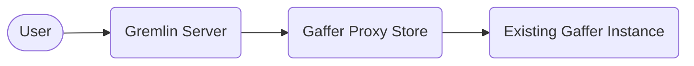

# Connecting Gremlin to Gaffer

It is possible to use Gremlin as an alternative querying language in Gaffer. To
make Gremlin available however, there are some additional steps that need to be
taken to connect to a Gaffer graph via this interface.

## Overview

Gremlin serves as a query layer for a graph that implements the Tinkerpop graph
structure. As of v2.1.0 Gaffer has made available a library that can be utilised
to enable Gremlin queries. This library can be included via maven in any project
using the following dependency definition:

```xml
<dependency>
    <groupId>uk.gov.gchq.gaffer</groupId>
    <artifactId>tinkerpop</artifactId>
    <version>${gaffer.version}</version>
</dependency>
```

The library contains the graph implementation that allows Tinkerpop to talk to a
Gaffer graph and generally is all that is needed to provide the functionality.
To actually utilise Gremlin queries however, a connection to what's known as a
`GraphTraversalSource` is required which is the class from which Gremlin
traversals are spawned. To do this we recommend utilising the provided
[Gremlin server framework](https://tinkerpop.apache.org/docs/current/reference/#connecting-gremlin-server)
which can be configured to use the Gaffer Tinkerpop implementation so that a
endpoint is available for Gremlin queries.

## Connecting to Any Existing Gaffer Graph

The simplest way to connect Gremlin to an existing Gaffer instance where you may
not know the Store type or Schema would be via a [Proxy Store](../gaffer-stores/proxy-store.md).
Connecting this way means Gremlin communicates via the Gaffer REST API
(similar to [gafferpy](../../user-guide/apis/python-api.md)) meaning there may
be a performance hit for larger queries.

!!! tip
    You can also of course connect directly to an existing instance's storage
    layer too (e.g. Accumulo store) but this would require a more complex
    configuration and knowledge of the Schema.

The general connection diagram looks something like the following:



To establish this connection you can make use of the existing `gaffer-gremlin`
OCI image which is an extension of the existing `gremlin-server` image. This
provides the Tinkerpop library to enable connecting to Gaffer graphs as well as
some pre installed configuration to get up and running quickly.

```bash
docker pull gchq/gaffer-gremlin:latest
```

!!! note
    You will likely need to configure the default `gaffer-gremlin` image to your
    environment, please continue reading to learn more.

### Configuring the `gaffer-gremlin` Image

To use the image you will need to provide two configuration files that are specific
to your environment, they are:

- `store.properties` - Gaffer store configuration.
- `gafferpop.properties` - Configuration for the Gaffer Tinkerpop library (Gafferpop).

Once these files are configured you can use bind mounts to make them available when running the image:

```bash
docker run \
       --name gaffer-gremlin \
       --publish 8182:8182 \
       --volume store.properties:conf/gaffer/store.properties \
       --volume gafferpop.properties:conf/gafferpop/gafferpop.properties \
       tinkerpop/gremlin-server:latest gremlin-server.yaml
```

#### Configuring the Proxy Store

Starting with the Proxy Store, this is identical to running a normal [Proxy Store](../gaffer-stores/proxy-store.md)
and involves simply creating a Gaffer `store.properties` file to use. An example
`store.properties` file is given below that will connect to a graph's REST API
running at `https://localhost:8080/rest`:

```properties
gaffer.store.class=uk.gov.gchq.gaffer.proxystore.ProxyStore
# These should be configured to an existing graph deployment
gaffer.host=localhost
gaffer.port=8080
gaffer.context-root=/rest
```

#### Configuring the Gafferpop Library

The `gafferpop.properties`, file is the configuration for the Gaffer
implementation of Tinkerpop (a.k.a Gafferpop). Most of the set up here is for
the construction of the Gafferpop Graph instance which we want to make run with
the `store.properties` we've already configured. An example `gaffer.properties`
would look like the following:

```properties
# The Tinkerpop graph class we should use
gremlin.graph=uk.gov.gchq.gaffer.tinkerpop.GafferPopGraph
gaffer.graphId=graphProxy
gaffer.storeproperties=conf/gaffer/store.properties
gaffer.userId=user01
```

Many of these properties in the example above should be self explanatory, a full breakdown of
of the available properties is as follows:

| Property Key | Description |
| --- | --- |
| `gremlin.graph` | The Tinkerpop graph class we should use |
| `gaffer.graphId` | The graph ID of the Tinkerpop graph |
| `gaffer.storeproperties` | The path to the store properties file |
| `gaffer.schemas` | The path to the directory containing the graph schema files |
| `gaffer.userId` | The user ID for the Tinkerpop graph |
| `gaffer.dataAuths` | The data auths for the user to specify what operations can be performed |
| `gaffer.operation.options` | Additional operation options that will be passed to the Tinkerpop graph variables in the form `key:value`

#### Configuring the Gremlin Server

The underlying Gremlin server can also be configured if required. The `gaffer-gremlin`
image comes with an existing YAML configuration based on the example from the
[Tinkerpop repository](https://github.com/apache/tinkerpop/blob/master/gremlin-server/conf/gremlin-server.yaml).
This file should be suitable for most use cases but a custom one can be provided
via a bind mount. If supplying a custom file please ensure you still include the
following sections:

Ensure the `gafferpop.properties` file is set by modifying the `graphs` section like so:

```yaml
graphs: {
  graph: conf/gafferpop/gafferpop.properties
}
```

Ensure the Gaffer plugin is loaded for Gremlin which is achieved by adding the
following to the list of plugins in the `plugins` section:

```yaml
uk.gov.gchq.gaffer.tinkerpop.gremlinplugin.GafferPopGremlinPlugin: {}
```

!!! tip
    See the [Tinkerpop docs](https://tinkerpop.apache.org/docs/current/reference/#gremlin-server)
    for more information on Gremlin server configuration.
