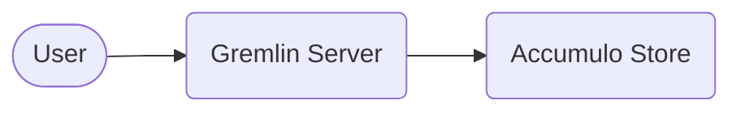

# Connecting Gremlin to Gaffer

It is possible to use Gremlin as an alternative querying language in Gaffer. To
make Gremlin available however, there are some additional steps that need to be
taken to connect to a Gaffer graph via this interface.

## Overview

Gremlin serves as a query layer for a graph that implements the Tinkerpop graph
structure. As of v2.1.0 Gaffer has made available a library that can be utilised
to enable Gremlin queries. This library can be included via maven in any project
using the following dependency definition:

```xml
<dependency>
    <groupId>uk.gov.gchq.gaffer</groupId>
    <artifactId>tinkerpop</artifactId>
    <version>${gaffer.version}</version>
</dependency>
```

The library contains the graph implementation that allows Tinkerpop to talk to a
Gaffer graph and generally is all that is needed to provide the functionality.
To actually utilise Gremlin queries however, a connection to what's known as a
`GraphTraversalSource` is required which is the class from which Gremlin
traversals are spawned. To do this we recommend utilising the provided
[Gremlin server framework](https://tinkerpop.apache.org/docs/current/reference/#connecting-gremlin-server)
which can be configured to use the Gaffer Tinkerpop implementation so that a
endpoint is available for Gremlin queries.

## Connecting to An Existing Accumulo Backed Graph

The recommended way to provide a Gremlin interface to an existing Gaffer
instance is to connect directly to the same [Accumulo store](../gaffer-stores/accumulo-store.md).
Connecting this way means Gremlin communicates in a similar way to the Gaffer
REST API and ensures the fastest performance when using Gremlin (there may still
be a performance hit).

The general connection diagram looks something like the following:



To establish this connection you can make use of the existing `gaffer-gremlin`
OCI image which is an extension of the existing `gremlin-server` image. This
provides the Tinkerpop library which allows users to connect Gaffer graphs as
well as some pre installed configuration to get up and running quickly.

```bash
docker pull gchq/gaffer-gremlin:latest
```

!!! note
    You will need to configure the default `gaffer-gremlin` image to your
    environment, please continue reading to learn more.

### The `gaffer-gremlin` Image

To use the image you will need to provide the normal Gaffer configuration files
for to your environment along with a new GafferPop specific file (similar to the
standard graph config JSON) they are:

- `store.properties` - Gaffer store configuration, this should match the
  existing graph you are connecting to.
- `elements.json` and `types.json` - The schema files for the graph you wish to
  connect to.
- `gafferpop.properties` - Configuration for the Gaffer Tinkerpop library
  (Gafferpop).

Please read the subsections below on how to configure these files. Once these
are configured you can use bind mounts to make them available when running the
image:

```bash
docker run \
       --name gaffer-gremlin \
       --publish 8182:8182 \
       --volume store.properties:/opt/gremlin-server/conf/gaffer/store.properties \
       --volume schema:/opt/gremlin-server/conf/gaffer/schema \
       --volume gafferpop.properties:/opt/gremlin-server/conf/gafferpop/gafferpop.properties \
       tinkerpop/gremlin-server:latest gremlin-server.yaml
```

### Configuring the Store Properties

Starting with the Store properties, this file should be largely identical to
the store properties used on the main Gaffer deployment. The main purpose
of this file is to ensure the same Accumulo cluster is connected to.

An example file is given below, please read the specific [Accumulo store](../gaffer-stores/accumulo-store.md)
documentation for more detail:

```properties
gaffer.store.class=uk.gov.gchq.gaffer.accumulostore.AccumuloStore
gaffer.store.properties.class=uk.gov.gchq.gaffer.accumulostore.AccumuloProperties
accumulo.instance=accumulo
accumulo.zookeepers=zookeeper
accumulo.user=root
accumulo.password=secret
# General store config
gaffer.cache.service.class=uk.gov.gchq.gaffer.cache.impl.HashMapCacheService
gaffer.store.job.tracker.enabled=true
```

### Configuring the Gafferpop Library

The `gafferpop.properties`, file is the configuration for the Gaffer
implementation of Tinkerpop (a.k.a Gafferpop). Most of the set up here is for
the construction of the Gafferpop Graph instance which we want to make run with
the `store.properties` we've already configured. An example `gaffer.properties`
would look like the following:

```properties
# The Tinkerpop graph class we should use
gremlin.graph=uk.gov.gchq.gaffer.tinkerpop.GafferPopGraph
gaffer.graphId=existingGraph
gaffer.storeproperties=conf/gaffer/store.properties
gaffer.userId=user01
```

!!! note
    It is important the `graphId` here matches the ID of the main graph you
    wish to connect to as this controls which Accumulo table is connected to.

Many of these properties in the example above should be self explanatory, a full breakdown of
of the available properties is as follows:

| Property Key | Description |
| --- | --- |
| `gremlin.graph` | The Tinkerpop graph class we should use |
| `gaffer.graphId` | The graph ID of the Tinkerpop graph |
| `gaffer.storeproperties` | The path to the store properties file |
| `gaffer.schemas` | The path to the directory containing the graph schema files |
| `gaffer.userId` | The default user ID for the Tinkerpop graph (see the [authentication section](#user-authentication)) |
| `gaffer.dataAuths` | The default data auths for the user to specify what operations can be performed |
| `gaffer.operation.options` | Default `Operation` options in the form `key:value` (this can be overridden per query see [here](../../user-guide/query/gremlin/gremlin.md#custom-features)) |

### Configuring the Gremlin Server

The underlying Gremlin server can also be configured if required. The `gaffer-gremlin`
image comes with an existing YAML configuration based on the example from the
[Tinkerpop repository](https://github.com/apache/tinkerpop/blob/master/gremlin-server/conf/gremlin-server.yaml).
This file should be suitable for most use cases but a custom one can be provided
via a bind mount. If supplying a custom file please ensure you still include the
following sections:

Ensure the `gafferpop.properties` file is set by modifying the `graphs` section like so:

```yaml
graphs: {
  graph: conf/gafferpop/gafferpop.properties
}
```

Ensure the Gaffer plugin is loaded for Gremlin which is achieved by adding the
following to the list of plugins in the `plugins` section:

```yaml
uk.gov.gchq.gaffer.tinkerpop.gremlinplugin.GafferPopGremlinPlugin: {}
```

!!! tip
    See the [Tinkerpop docs](https://tinkerpop.apache.org/docs/current/reference/#gremlin-server)
    for more information on Gremlin server configuration.

#### User Authentication

Full user authentication is possible with the Gremlin server using the framework
provided by standard Tinkerpop. The GafferPop implementation provides a
functional `Authoriser` class that will handle passing the authenticated user to
the underlying Gaffer graph.

To activate user auth with the Gremlin server you must provide the classes you
wish to use in the Gremlin server's YAML file like so:

```yaml
# This should be a deployment specific class
authentication: {
  authenticator: uk.gov.gchq.gaffer.tinkerpop.server.auth.ExampleGafferPopAuthenticator
}
# This class is necessary for correctly forwarding the user to Gaffer
authorization: {
  authorizer: uk.gov.gchq.gaffer.tinkerpop.server.auth.GafferPopAuthoriser
}
```

The `authorizer` should always be the `GafferPopAuthoriser` as this is what
handles denying invalid queries for GafferPop and passing the user on to the
Gaffer graph for fine grained security.

!!! note
    The `GafferPopAuthoriser` will deny attempts to set the user ID via a
    `with("userId", <id>)` step in the Gremlin query.

The `authenticator` should be a class specific to the auth mechanism for your
deployment e.g. LDAP. An example class `ExampleGafferPopAuthenticator` is
provided as a start point but does not do any actual authenticating so should
**not** be used in production.

!!! tip
    Tinkerpop provides some implementaions of `Authenticators` for standard
    mechanisms such as [Kerberos](https://tinkerpop.apache.org/javadocs/current/full/org/apache/tinkerpop/gremlin/server/auth/Krb5Authenticator.html).
    Please see the [Tinkerpop documentation](https://tinkerpop.apache.org/docs/current/reference/#security) for more info.
