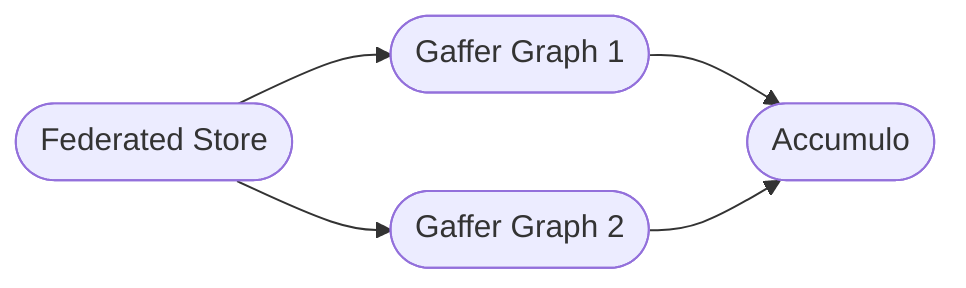

# Simple Federated Store Configuration

!!! warning
    The simple federated store is still under development, with scope to replace
    the standard federated store in release 2.4.0. Some configuration options
    and features may be subject to change.

## Introduction

The Simple Federated Store enables a user to add and query multiple Gaffer
graphs through a single endpoint/instance. Queries submitted to a federated
store are forwarded to a select set of graphs that then execute the query
locally. The results from each graph are aggregated together to form the
final result to give the appearance of coming from one graph.

Due to its unique nature a federated store has various additional configuration
and features compared to a normal store. This page covers the different
configuration an admin can apply to this store type. Further information on
[controlling graph access](./access-control.md) and [additional considerations](./additional-info.md)
with a federated store can be found on thier respective pages.

To get started with a federated store simply set the store class and properties
like:

```properties
gaffer.store.class=uk.gov.gchq.gaffer.federated.simple.FederatedStore
gaffer.store.properties.class=uk.gov.gchq.gaffer.federated.simple.FederatedStoreProperties
```

## Store Properties

As with a standard Gaffer graph the usual store properties are available to a
federated store; however, additional properties are available to configure the
the different aspects of federating. The table below covers store properties
specific to a federated store and their usage.

!!! note
    Many of the merge related properties are just defaults and can be overridden
    by the user on a per query basis.

| Property | Default | Description |
| --- | --- | --- |
| `gaffer.store.federated.default.graphIds` | `""` | The list of default graph IDs for if a user does not specify what graph(s) to run their query on. Takes a comma separated list of graph IDs e.g. `"graphID1,graphID2"` |
| `gaffer.store.federated.allowPublicGraphs` | `true` | Are graphs with public access allowed to be added to this store. |
| `gaffer.store.federated.default.aggregateElements` | `false` | Should queries aggregate returned Gaffer elements together using the binary operator for merging elements. False by default as it can be slower meaning results are just chained into one big list. |
| `gaffer.store.federated.merge.number.class` | `uk.gov.gchq.koryphe.impl.binaryoperator.Sum` | Default binary operator for merging [`Number`](https://docs.oracle.com/javase/8/docs/api/java/lang/Number.html) results (e.g. from a `Count` operation) from multiple graphs. |
| `gaffer.store.federated.merge.string.class` | `uk.gov.gchq.koryphe.impl.binaryoperator.StringConcat` | Default binary operator for merging [`String`](https://docs.oracle.com/javase/8/docs/api/java/lang/String.html) results from multiple graphs. |
| `gaffer.store.federated.merge.boolean.class` | `uk.gov.gchq.koryphe.impl.binaryoperator.And` | Default binary operator for merging [`Boolean`](https://docs.oracle.com/javase/8/docs/api/java/lang/Boolean.html) results from multiple graphs. |
| `gaffer.store.federated.merge.collection.class` | `uk.gov.gchq.koryphe.impl.binaryoperator.CollectionConcat` | Default binary operator for merging [`Collection`](https://docs.oracle.com/javase/8/docs/api/java/util/Collection.html) results from multiple graphs. |
| `gaffer.store.federated.merge.map.class` | `uk.gov.gchq.koryphe.impl.binaryoperator.Last` | Default binary operator for merging the values of [`Map`](https://docs.oracle.com/javase/8/docs/api/java/util/Map.html) results when two of the same keys exist from multiple graphs. |
| `gaffer.store.federated.merge.element.class` | `uk.gov.gchq.gaffer.federated.simple.merge.operator.ElementAggregateOperator` | Default binary operator for merging Iterables of Gaffer elements from multiple graphs. |

## Merge Operators

A key part to the federated store are the merge operators. These control how
results from multiple graphs are reduced to one result so can greatly effect the
results returned by the store. As outlined in the [store properties section](#store-properties),
these operators can be configured with defaults or overridden for a query via the
operation options using the same properties.

Sensible defaults are in place if not specified however, you may wish to chose your
own operators to be used. The only requirement for an operator is for it to
satisfy Java's [`BinaryOperator`](https://docs.oracle.com/javase/8/docs/api/java/util/function/BinaryOperator.html)
interface, you can then specify it using the property key for the data type you
wish to use it for.

### The Default Element Merge Operator

The default operator used to merge Gaffer elements is unique compared to the
other operators. This operator will only be used if element aggregating is set
to "true", either by default, using the store properties, or for just the query
using the operation option `federated.aggregateElements`.

When enabled, by default the operator will attempt to use the aggregation
functions from the merged schema of the graphs that were executed on. This
attempts to emulate how the data would have been stored in a single Gaffer graph
as, entities or edges that are the same (e.g. same group and vertices) will be
merged together with their properties aggregated using the functions defined in
the schema.

#### Considerations

There are some considerations you may wish to know when using the element merge
operator:

- This type of merging will be inherently slower than simply returning a chained
iterable of elements.
- The results must fit in the available memory of the federated store to be
merged. If the returned result size is too big you may experience significant
performance issues.
- The results will be deduplicated as part of this process e.g. two identical
entities or edges will be merged into one.
- Any filtering you might have specified in the `View` will only be applied
to the individual graph results, this means two results separately will
satisfy the filter but once aggregated they may not.
- If you wish to write or use your own operator for merging elements the class
must extend the [`ElementAggregateOperator`](https://github.com/gchq/Gaffer/blob/develop/store-implementation/simple-federated-store/src/main/java/uk/gov/gchq/gaffer/federated/simple/merge/operator/ElementAggregateOperator.java).

## Adding and Removing Graphs

A federated stores main purpose is to hold a library of 'sub' graphs. These
graphs are stored in the Gaffer cache so can be shared between multiple
federated stores (you can read more about the cache [here](./additional-info.md#cache-considerations)).

You can think of a graph that has been added to a federated store as essentially
a pointer to the real graph. This generally means all the information required
to create the graph in the first place (e.g. schema, store properties etc.) are
required to add the graph to a federated store. Because of this, a common design
pattern you may wish to adopt is to have one running Accumulo cluster to which,
you can add multiple Gaffer graphs through the federated store. This means you
do not need to setup multiple Gaffer instances and can query all of the graphs
through the federated store.



### Adding a new Graph

To add a new graph to a federated store a unique operation is available to
federated stores called `AddGraph`. This operation lets you input the
graph config, schema and store properties for the graph letting you add a
new graph like so:

!!! example ""
    === "Java"
        ```java
        // Choose a graph ID for your graph
        final String graphId = "myGraph";

        // Replace the graph config, schema and properties for your use case
        final AddGraph operation = new AddGraph.Builder()
            .graphConfig(new GraphConfig(graphId))
            .schema(new Schema())
            .properties(new Properties())
            .build();
        ```

    === "JSON"
        Replace the graph config, schema and properties for your use case.

        ```json
        {
            "class": "uk.gov.gchq.gaffer.federated.simple.operation.AddGraph",
            "graphConfig": {
                "graphId": "myGraph"
            },
            "schema": {
                "entities": {},
                "edges": {},
                "types": {}
            },
            "properties": {
                "gaffer.store.class": "uk.gov.gchq.gaffer.accumulostore.AccumuloStore",
                "gaffer.store.properties.class": "uk.gov.gchq.gaffer.accumulostore.AccumuloProperties",
                "gaffer.cache.service.class": "uk.gov.gchq.gaffer.cache.impl.HashMapCacheService"
            }
        }
        ```

Once a graph has been added the graph ID will become available to the store so
can be referenced when running an operation. More information on running an
operation on a sub graph and available operation options can be found on the
[following page](./additional-info.md#how-are-operations-handled).

!!! note
    Added graphs can also have access controls enforced on them, please see the
    [access control guide](./access-control.md) for more information.

### Removing a Graph

Along with adding a graph you can also remove a graph from a federated store. By
default this will simply dereference the graph, meaning if the graph had
persistent storage the data will be left untouched. The data can then be
re-accessed at a later date by simply adding the graph back to the store.

When removing a graph you can also opt to delete all the data as well. This
obviously means the data cannot be recovered by simply re-adding the graph at a
later date.

!!! note
    To remove a graph a user requires write access to graph, please see the
    [access control guide](./access-control.md) for more information.

To remove a graph you can use the following operation like so:

!!! example ""
    === "Java"
        Remove a graph leaving the data untouched (if persistent).

        ```java
        final RemoveGraph removeGraph = new RemoveGraph.Builder()
            .graphId(graphId)
            .build();
        ```

        Remove a graph and delete all the data.

        ```java
        final RemoveGraph removeGraph = new RemoveGraph.Builder()
            .graphId(graphId)
            .deleteAllData(true)
            .build();
        ```

    === "JSON"
        Remove a graph leaving the data untouched (if persistent).

        ```json
            {
                "class": "uk.gov.gchq.gaffer.federated.simple.operation.RemoveGraph",
                "graphId": "myGraph"
            }
        ```

        Remove a graph and delete all the data.

        ```json
            {
                "class": "uk.gov.gchq.gaffer.federated.simple.operation.RemoveGraph",
                "graphId": "myGraph",
                "deleteAllData": true
            }
        ```
