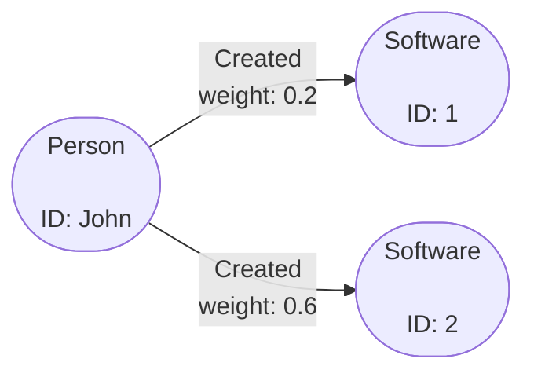

# Named Views

This guide walks through configuring Gaffer to use Named Views and how to run them.

Named Views allow users to store a [View](../user-guide/query/gaffer-syntax/filtering.md)
in the cache, this can then be called on in OperationChains or in NamedOperations.

The benefit of using Named Views is that it allows you to store lengthy or complex Views
that you can then re-use, i.e. run multiple different operations with the same filter applied.

## Using Named Views

All Named Views are stored in a cache, so your first step should be to configure a suitable cache.
For details on potential caches and how to configure them, see the [Stores Guide](../administration-guide/gaffer-stores/store-guide.md#caches).

!!! Note
    If you choose a non-persistent cache then any Named Views will be lost when you shut down your instance of Gaffer.

Named Views are enabled by default. To disable this feature the [store property](../administration-guide/gaffer-stores/store-guide.md#all-general-store-properties) `gaffer.store.namedview.enabled` should be set to false.

There are [three operations](../reference/operations-guide/named.md#addnamedview) which manage Named Views.
These are `AddNamedView`, `GetAllNamedViews` and `DeleteNamedView`.

The examples below use the following graph:



!!! example "Adding a NamedView"
    This example adds a NamedView that filters the data on the `Created` edge with a weight greater than `0.4`.

    === "Java"

        ``` java
        final AddNamedView view = new AddNamedView.Builder()
            .name("exampleNamedView")
            .description("Example Named View")
            .overwrite(true)
            .view(new View.Builder()
                .edge("Created", new ViewElementDefinition.Builder()
                    .preAggregationFilter(new ElementFilter.Builder()
                        .select("weight")
                        .execute(new IsMoreThan(0.4))
                        .build())
                    .build())
                .build()
            .build());
        ```

    === "JSON"

        ``` json
        {
            "class" : "AddNamedView",
            "name" : "exampleNamedView",
            "description" : "Example Named View",
            "view": {
                "edges": {
                    "Created": {
                        "preAggregationFilterFunctions": [
                            {
                                "selection": [
                                    "weight"
                                ],
                                "predicate": {
                                    "class": "IsMoreThan",
                                    "orEqualTo": false,
                                    "value": {
                                        "Float": 0.4
                                    }
                                }
                            }
                        ]
                    }
                }
            },
            "overwriteFlag" : true
        }
        ```

    === "Python"

        ``` python
        g.AddNamedView(
            view = g.View(
                edges = [
                    g.ElementDefinition(
                        group = 'Created',
                        pre_aggregation_filter_functions = [
                            g.PredicateContext(
                                selection = ['weight'],
                                predicate = g.IsMoreThan(
                                    value = {'java.lang.Float': 0.4},
                                    or_equal_to = False
                                )
                            )
                        ]
                    )
                ]
            ),
            overwrite_flag=True
        )
        ```

!!! example "Using a NamedView"
    This executes the View within a `GetElements` operation.

    === "Java"

        ```java
        final GetElements operation = new GetElements.Builder()
            .input(new EntitySeed("John"))
            .view(new NamedView.Builder()
                .name("exampleNamedView")
                .build())
            .build();

        graph.execute(operation, user)
        ```

    === "JSON"

        ```json
        {
            "class": "GetElements",
            "input": [
                {
                    "class": "EntitySeed",
                    "vertex": "John"
                }
            ],
            "view": {
                "class": "NamedView",
                "name": "exampleNamedView"
            }
        }
        ```

    === "Python"

        ```python
        g_connector.execute_operation(
            operation = g.GetElements(
                input = [g.EntitySeed(vertex = "John")]
                view = g.View(
                   g.NamedView(
                        name="exampleNamedView"
                   )
                )
            )
        )
        ```

!!! example "Delete a NamedView"
    This removes the NamedView from the cache. Note that if you delete a Named View
    any Operation Chains or Named Operations which reference it will fail.

    === "Java"

        ``` java
        final DeleteNamedView view = new DeleteNamedView.Builder()
            .name("exampleNamedView")
            .build();
        ```

    === "JSON"

        ``` json
        {
            "class": "DeleteNamedView",
            "name": "exampleNamedView"
        }
        ```

    === "Python"

        ``` python
        g.DeleteNamedView(
            name="exampleNamedView"
        )
        ```
