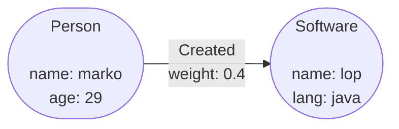

# Example Deployment

This guide will run through the start up and deployment of a basic Gaffer instance. It will cover
how to write a basic Gaffer Schema from scratch along with using the pre-made containers to run the
Gaffer REST API and Accumulo based data store.

!!! warning
    Please be aware that the example is only intended to demonstrate the core Gaffer concepts it is
    not a production example. Various additional configuration to Accumulo and the HDFS set up would
    be required to make this production ready and likely be specific to your infrastructure.

## The Example Graph

For this basic example we will attempt to recreate the graph in the following diagram consisting of
two entities with one directed edge between them.



This data describes one individual and a single piece of software that has been created by that
individual. The data will be loaded into the graph from a CSV file that follows the Neo4j export
syntax, this demonstrates how Gaffer can be used and how it can interact, model and query data from
other popular graph databases. Even with this basic graph we should be able to start building
queries to ask questions like "Who created the software called 'lop'?" and "How much did 'marko'
contribute to the software called 'lop'?" etc.

To go with the diagram above the following CSV file (both raw and rendered are provided) represents
the graph in [Neo4j syntax](https://neo4j.com/labs/apoc/4.4/export/csv/#export-database-csv).

!!! note ""
    Please note that Gaffer often requires additional information about the data such as,
    `:String` on the column headers to help with typing of the values. This is demonstrated below
    in the raw file. There's more detail on this in the [OpenCypher documentation](../../user-guide/query/gaffer-syntax/import-export/csv.md#opencypher-formats).

=== "Table"
    | _id | name  | age | lang | _labels  | _start | _end | _type   | weight |
    |-----|-------|-----|------|----------|--------|------|---------|--------|
    | v1  | marko | 29  |      | Person   |        |      |         |        |
    | v2  | lop   |     | java | Software |        |      |         |        |
    | e1  |       |     |      |          | v1     | v2   | Created | 0.4    |

=== "CSV"
    ```csv
    _id,name:String,age:Int,lang:String,_labels,_start,_end,_type,weight:Float
    v1,marko,29,,Person,,,,
    v2,lop,,java,Software,,,,
    e1,,,,,v1,v2,Created,0.4
    ```

## Project Setup

First you must set up the files and directories you will need for the instance. As it stands there
are a couple of different ways to run a Gaffer project this example will use a logical structure
that suites a stand alone deployment consisting of the following file structure:

!!! example "Example Gaffer project structure"

    !!! tip ""
        Click the plus symbols for a brief description of each file

    ```yaml
    ├── config
    │   ├── accumulo
    │   │   ├── accumulo-client.properties
    │   │   ├── accumulo-env.sh
    │   │   ├── accumulo.properties
    │   │   ├── core-site.xml
    │   │   └── log4j.properties
    │   ├── gaffer
    │   │   ├── application.properties #(1)!
    │   │   ├── data                   #(2)!
    │   │   │   ├── neo4jExport.csv
    │   │   ├── graph
    │   │   │   └── graphConfig.json #(3)!
    │   │   ├── schema
    │   │   │   ├── elements.json #(4)!
    │   │   │   └── types.json    #(5)!
    │   │   └── store
    │   │       ├── operationsDeclarations.json #(6)!
    │   │       └── store.properties            #(7)!
    │   └── hdfs
    │       ├── core-site.xml
    │       ├── hdfs-site.xml
    │       └── log4j.properties
    └── docker-compose.yaml #(8)!
    ```

    1. Properties file that generally sets the file locations of other Gaffer
        configs e.g. schemas (note these are the absolute paths inside the
        container).
    2. Any data files, e.g. CSV, to be made available to the Gaffer container.
    3. The main graph config file to set various properties of the overall graph.
    4. This file holds the schema outlining the elements in the graph, e.g. the
    entities and edges.
    5. This file defines the different data types in the graph and how they are
    serialised to Java classes.
    6. Config file for additional Gaffer operations and set the class to handle
    them on the store.
    7. The General store properties, sets up what store to use and any additional
    configuration.
    8. This file controls which containers will be started up and the configuration
    of them to ensure correct ports and files are available.

All the files in the `config/accumulo/` and `config/hdfs/` directories will be copied directly from
the two locations in the Gaffer docker repo,
[here](https://github.com/gchq/gaffer-docker/tree/develop/docker/accumulo/conf-2.0.1) and
[here](https://github.com/gchq/gaffer-docker/tree/develop/docker/hdfs/conf). The configuration of
these are out of scope of this example but are covered in other sections of the documentation. The
main focus of this guide will be on the configuration files under the `config/gaffer/` directory.

## Configuration Files

There's a full [break down of Gaffer schema files on the next page](./writing-the-schema.md), this
section will instead cover the smaller additional config files that go along side the main Gaffer
schema to tweak other aspects of the graph. The location of these files will need to be volume
mounted into the container for them to be included in the deployment which is covered in more detail
[later in the guide](./running-the-deployment.md).

!!! note
    Many of these files have defaults already in the standard `gaffer-rest` container image, but its
    useful to still include them in the project to allow easy configuration.

### Application Properties

This is probably the simplest configuration file in the Gaffer deployment. In general it borrows a
concept from [Spring Boot](https://docs.spring.io/spring-boot/docs/current/reference/html/application-properties.html)
to allow changing the context root and any properties related to Gaffer. In the example that follows
we use it to set the file location properties of where the other config files are (inside the
container).

```properties title="application.properties"
gaffer.schemas=/gaffer/schema
gaffer.storeProperties=/gaffer/store/store.properties
gaffer.graph.config=/gaffer/graph/graphConfig.json
```

### Graph Configuration

The graph configuration file is a JSON file that configures few bits of the Gaffer graph. Primarily
it is used to set the name and description along with any additional hooks to run before an operation
chain e.g. to impose limits on max results etc. For the example as, it is a very basic graph we just
set the name and short description.

```json title="graphConfig.json"
{
    "graphId": "ExampleGraph",
    "description": "An example graph"
}
```

### Store Properties

The store properties file is used to configure how Gaffer will store its data. There are a few
different stores available for Gaffer, these are explained in more detail in the [reference
documentation](../../administration-guide/gaffer-stores/store-guide.md), but by default you must provide a store
class and a store properties class. For this example we are using an Accumulo store as it is
recommended for efficient storage and retrieval of large data volumes. It's set up requires a few
custom properties which are outlined in the following file.

```properties title="store.properties"
gaffer.store.class=uk.gov.gchq.gaffer.accumulostore.AccumuloStore
gaffer.store.properties.class=uk.gov.gchq.gaffer.accumulostore.AccumuloProperties

# Accumulo specific config
accumulo.instance=accumulo
accumulo.zookeepers=zookeeper
accumulo.user=root
accumulo.password=secret

# General store config
gaffer.cache.service.class=uk.gov.gchq.gaffer.cache.impl.HashMapCacheService
gaffer.store.job.tracker.enabled=true
gaffer.store.operation.declarations=/gaffer/store/operationsDeclarations.json
```

### Operations Declarations

The operation declarations file is a way of enabling additional operations in Gaffer. By default
there are some built in operations already available (the REST API has a get all operations request
to see a list), but its likely you might want to enable others or add your own custom ones. As the
example will load its data from a local CSV file we can activate a couple of additional operations
using the following file.

```json title="operationsDeclarations.json"
{
    "operations": [
        {
            "operation": "uk.gov.gchq.gaffer.operation.impl.export.localfile.ImportFromLocalFile",
            "handler": {
                "class": "uk.gov.gchq.gaffer.store.operation.handler.export.localfile.ImportFromLocalFileHandler"
            }
        },
        {
            "operation": "uk.gov.gchq.gaffer.operation.impl.export.localfile.ExportToLocalFile",
            "handler": {
                "class": "uk.gov.gchq.gaffer.store.operation.handler.export.localfile.ExportToLocalFileHandler"
            }
        }
    ]
}
```

The two additional operations already exist in Gaffer (in the code base:
[ImportFromLocalFile](https://github.com/gchq/Gaffer/blob/develop/core/operation/src/main/java/uk/gov/gchq/gaffer/operation/impl/export/localfile/ImportFromLocalFile.java)
and
[ExportToLocalFile](https://github.com/gchq/Gaffer/blob/develop/core/operation/src/main/java/uk/gov/gchq/gaffer/operation/impl/export/localfile/ExportToLocalFile.java)),
what this file is doing is essentially activating them and setting the handler class for them. The
`ImportFromLocalFile` usage is demonstrated in the [using the API](./using-the-api.md) section to
load some data.

This operation allows us to pass a local CSV file (in the container) which will be read line by line
and get a stream of the line strings. This is very useful when we start using Operation Chains as
we can pass this stream of data as the input to the next operation in the chain similar to shell
pipes.

!!! note
    The location of the file needs to be set via the store properties file using the
    `gaffer.store.operation.declarations` property (see [previous section](#store-properties)).
