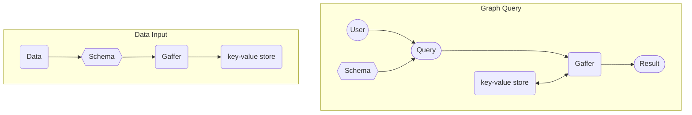

# Gaffer Basics

## What is Gaffer?

Gaffer is a graph database framework, it acts similarly to an interface providing a graph data
structure on top of a chosen storage technology to enable storage of large graphs and traversal of
it's nodes and edges. In a nutshell Gaffer allows you to take data, convert it into a graph, store it
in a database and then run queries and analytics on it.

The high level interactions of loading data and querying are demonstrated in the diagrams below.



## Gaffer Schemas

One of the main differences between Gaffer and other graph database tools are its schemas. In Gaffer
JSON based schemas need to be written upfront for it to understand how to load and treat the data in
the graph. These schemas define all aspects of the nodes and edges in the graph, and can even be
used to automatically do basic analysis or aggregation on queries and ingested data.

You can kind of think of the schema as sort of a filter or validator for the incoming data. A
given bit of data must conform with part of the schema or it will simply be ignored as it doesn't
fit the structure of the graph.

### Elements Schema

All distinct bits of data in a Gaffer graph (e.g. nodes and edges) are referred to as 'elements'.
The structure and properties of these graph elements are defined in the elements schema. The general
format of an element schema are two lists; one of the `"edges"` and the other of the `"entities"`
like the following:

!!! example "Basic elements syntax"

    ```json
    {
        "edges": {
            "Edge": {
                "source": "type",
                "destination": "type",
                "directed": "true",
                "properties": {
                    "property": "type"
                }
            }
        },
        "entities": {
            "Node": {
                "description": "A Node",
                "vertex": "type",
                "properties": {
                    "property": "type"
                }
            }
        }
    }
    ```

As you can see there are a few fields for both the example `"Edge"` and `"Node"`, many of these
require a type as their value (discussed in the [next section](#types-schema)) which are
essentially handlers or object types for the value associated with the field.

For an `edge` the following fields are required:

- `source` - A user defined type for the source node the edge originated from.

- `directed` - Boolean true or false to define if the edge is directed or not. When an Edge is
    undirected in Gaffer, it is treated as if the relationship was bidirectional and the vertices of
    the edge do not have an authoritative source and destination.

    !!! note ""
        The type here, `"true"` or `"false"` needs to be defined in the types schema using a class
        that evaluates to it. This is demonstrated in the [example
        deployment](./example-deployment/writing-the-schema.md) document.

- `destination` - A user defined type for the destination node the edge goes to.

For an `entity` only one field is required:

- `vertex` - A user defined type for the node/vertex.

!!! note ""
    The example includes some of the common optional fields too such as a `"properties"` list and
    `"description"`.

### Types Schema

Following on from the elements schema, the other necessary schema needed for a Gaffer deployment is
the types schema.  The types schema allows user defined types for all elements in the graph. It can
also demonstrate the power of Gaffer as it allows for custom functions classes to be used on the
types; however, this can make it quite complex to write a full schema for a graph.

!!! example "Example types syntax"

    ```json
    {
        "types": {
            "type.string": {
                "description": "A basic type to hold the string value of an element",
                "class": "java.lang.String"
            },
            "type.int": {
                "description": "A basic type to hold the int value of an element",
                "class": "java.lang.Integer"
            }
        }
    }
    ```

## The API

This section covers the currently available APIs that can be used to interact with a Gaffer graph.

### Swagger Rest API

Most of the interaction with a deployed Gaffer graph covered in this documentation will be through
the rest API. When deployed, the rest API will be available at a configurable address, accessing
this address via a browser brings up a [Swagger UI](https://swagger.io/) with various GET and POST
requests predefined for you to start using.

Most of the GET requests simply retrieve information about the graph which can be useful to ensure
your config files have been loaded correctly and the graph is operating normally. The POST requests
allow you to interact with the graph by loading data and running queries.

The main POST request end point you will use is `/graph/operations/execute`, this will ingest raw
JSON to carry out operations on the Gaffer graph. Gaffer provides many pre built operations that are
available to use and can be chained together for more complex use cases. However be aware, that
operation chains are usually highly specific to the data and results you wish to extract from the
graph so please refer to the reference guide on [Gaffer
operations](../reference/operations-guide/operations.md) for more detail on this.

!!! example "Example operation chain using rest API"

    The following operation chain gets all the elements in the graph then will count them and
    return the total.

    ```json
    {
        "class": "OperationChain",
        "operations": [
            {
                "class": "GetAllElements"
            },
            {
                "class": "Count"
            }
        ]
    }
    ```

### Python API

Along side the rest API there also exists a Python API. Commonly referred to as `gafferpy` this API
enables similar querying capabilities as the rest API but from Python code. Fundamentally it wraps
the rest API to use  the same JSON under the hood this means you should be able to access any
features or end points available in the main rest API.

To get started with `gafferpy` simply import the module and connect to an existing graph.

```python
from gafferpy import gaffer
from gafferpy import gaffer_connector
g_connector = gaffer_connector.GafferConnector("http://localhost:8080/rest/latest")
```

Then once connected you can access and run the same endpoints and operations as you would via the
usual rest API.

!!! example "Example operation chain using `gafferpy`"

    The following operation chain gets all the elements in the graph then will count them and
    store the total in the variable `count`.

    ```python
    count = g_connector.execute_operation_chain(
        operation_chain = gaffer.OperationChain(
            operations=[
                gaffer.GetAllElements(),
                gaffer.Count()
            ]
        )
    )
    ```

### Java API

As Gaffer is written in Java there is native support to allow use of all its public classes. Using
Gaffer via the Java interface does differ from the rest API and `gafferpy` but is fully featured
with extensive [Javadocs](https://gchq.github.io/Gaffer/overview-summary.html).

!!! example "Example operation chain using Java"

    The following operation chain gets all the elements in the graph then will count them and
    store the result in a `Long`.

    ```java
    OperationChain<Long> countAllElements = new OperationChain.Builder()
        .first(new GetAllElements())
        .then(new Count<>())
        .build();

    Long result = graph.execute(countAllElements, user);
    ```
