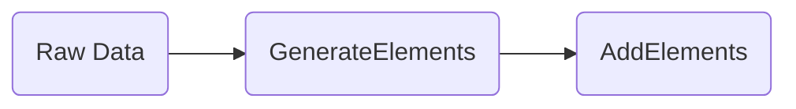

# Using the API

!!! info "Work in Progress"

    This page is under construction.

As covered in the [Gaffer basics](../basics.md) the main POST request used in the API is
`/graph/operations/execute`. This part of the guide will cover the general usage of this part of the
API and walk through some general operations you might want to use to load data or query.

!!! note
    Please refer to the reference guide on [Gaffer
    operations](../../reference/operations-guide/operations.md) for more detail on available
    operations.

## Loading Data

Gaffer supports various aspects of loading data, generally this is done in a few stages which are
outlined in the following diagram.



The first stage is taking the raw input data and converting it into Gaffer elements via an element
generator class. Gaffer includes a few built in
[generators](../../reference/operations-guide/generate.md) but you can use a custom class or
pre-process the data before passing to Gaffer so that you're able to use a default generator. Once
the data has been converted to elements it needs to be added into the graph. To load elements there
is a standard `AddElements` operation which takes raw elements JSON as input and adds them into the
graph.

!!! info
    This is where the schema is used here to validate the elements are correct and conform before
    adding.

Using the example again we will demonstrate how we could write an operation chain to load the data
from the neo4j formatted CSV file.

```json
{
    "class": "OperationChain",
    "operations": [
        {
            "class": "ImportFromLocalFile",
            "filePath": "/gaffer/data/neo4jExport.csv"
        },
        {
            "class": "GenerateElements",
            "elementGenerator": {
                "class": "Neo4jCsvElementGenerator"
            }
        },
        {
            "class": "AddElements"
        }
    ]
}
```

The operation chain above essentially mirrors the stages in the previous diagram. In the example
chain we first ingest the data via the `ImportFromLocalFile` class (an additional operation we added
via the [`operationsDeclarations.json`](./additional-config.md#operations-declarations)), which
streams the data from the CSV file into the next `GenerateElements` operation.

For the generator we have selected the built in `Neo4jCsvElementGenerator` class, this is already
set up to be able to parse a correctly formatted neo4j exported CSV into Gaffer elements via the
schema. If you are curious as to what the output of each operation is you can try run a subset of
this chain to see how the data changes on each one, the output should be returned back to you in the
server response section of the Swagger API.

## Querying Data

Once data is loaded in the graph its now possible to start querying the data to gain insight and
perform analytics. Querying in Gaffer can get fairly complex but generally simple queries are made
up of two parts; a `Get` Operation and a `View`.

Starting with the `Get` operation, say we want to get all nodes and edges based on their ID. To do
this we can use the `GetElements` operation and set the `Seed` to the entity (e.g. node) or edge
where we want to start the search. To demonstrate this on the example graph we can attempt to get
all entities and edges associated with the `Person` node with ID `v1`.

The result from this query should return the node associated with the `v1` id along with any edges
on this node, which in this case is just one

=== "Input Query"
    ```json
    {
        "class": "GetElements",
        "input": [
            {
                "class": "EntitySeed",
                "vertex": "v1"
            }
        ]
    }
    ```

=== "Example Result"

    ```json
    [
        {
            "class": "uk.gov.gchq.gaffer.data.element.Entity",
            "group": "Person",
            "vertex": "v1",
            "properties": {
            "name": "marko",
            "age": 29
            }
        },
        {
            "class": "uk.gov.gchq.gaffer.data.element.Edge",
            "group": "Created",
            "source": "v1",
            "destination": "v2",
            "directed": true,
            "matchedVertex": "SOURCE",
            "properties": {
            "weight": {
                "java.lang.Float": 0.4
            }
            }
        }
    ]
    ```

### Filtering Data

The final bit of querying this guide will go into is how to apply a `View` to a returned set of
elements. A `View` in Gaffer allows you to filter, aggregate, transform and just generally
manipulate the results. In general a `View` has the following possible use cases:

- **Filtering** - General filtering on elements based on predicates. Filtering can be applied
    pre-aggregation, post aggregation and post transformation.

- **Aggregation** - This is to control how similar elements are aggregated together. You can provide
    a subset of the schema `groupBy` properties and override the aggregation functions.

- **Transformation** - Transformations can be applied by providing Functions to transform properties
    and vertex values. This is a powerful feature, you can override the existing values or you can
    transform and save the new value into a new transient property.

- **Property Removal** - The relevant properties you want to be returned can be controlled. You can
    use either `properties` or `excludeProperties` to define the list of properties to be included
    or excluded.

Taking the example from the previous section we will demonstrate general filtering on a query. As
before, the query returns the node `v1` and any edges associated with it. We will now filter it to
include only edges where the weight is over a certain value. In this scenario it is analogous to
asking, *"get all the `Created` edges on node `v1` that have a `weight` greater than 0.3"*.

=== "Filter Query"

    ```json
    {
        "class": "GetElements",
        "input": [
            {
                "class": "EntitySeed",
                "vertex": "v1"
            }
        ],
        "view": {
            "edges": {
                "Created": {
                    "preAggregationFilterFunctions": [
                        {
                            "selection": [
                                "weight"
                            ],
                            "predicate": {
                                "class": "IsMoreThan",
                                "orEqualTo": false,
                                "value": {
                                    "Float": 0.3
                                }
                            }
                        }
                    ]
                }
            }
        }
    }
    ```

!!! tip
    As you can see filtering is based around predicates which are similar to if else statements in
    traditional programming. For a full list of available predicates refer to the reference
    [documentation](../../reference/predicates-guide/predicates.md).
