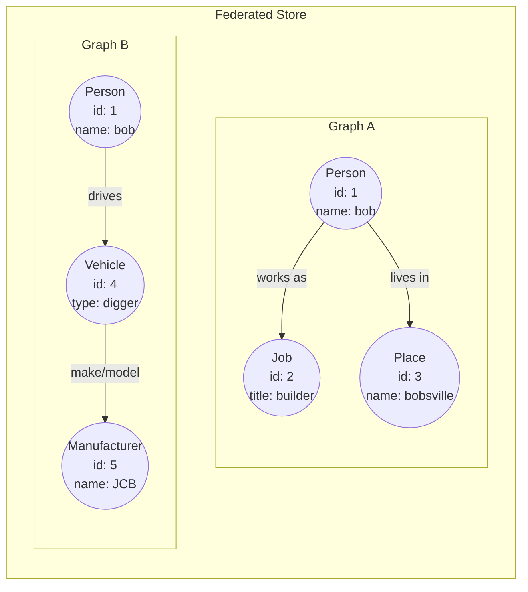

# Federated Operation

!!! note

    If you're upgrading from Gaffer 1.x.x you will need to [migrate from using the FederatedOperationChain to using the FederatedOperation](../../change-notes/migrating-from-v1-to-v2/federation-changes.md)

## The Federated Operation

The Federated Operation is an operation which can be used against a [Federated
Store](../../administration-guide/gaffer-stores/federated-store.md). The operation is used to send a
single or a chain of operations to one or more graphs within a federated store.
It can be configured to merge results differently depending on the
`mergeFunction` passed to it.

### Parameters
The Federated Operation has 3 key parameters: `operation`, `graphIds` and
`mergeFunction`:

!!! example ""
    ``` json
    {
        "class": "uk.gov.gchq.gaffer.federatedstore.operation.FederatedOperation",
        "operation": {
            "class": "uk.gov.gchq.gaffer.operation.impl.get.GetAllElements"
        },
        "graphIds": [ "graphA", "graphB" ],
        "mergeFunction": {
            "class": "uk.gov.gchq.gaffer.federatedstore.util.ConcatenateMergeFunction"
        }
    }
    ```

#### Required parameter: operation

This is the Operation you wish to be federated to the subgraphs. This can be a
single Operation or an OperationChain. If you use an OperationChain, then the
whole chain will be sent to the subgraphs.  

#### Optional parameter: graphIds

This is a list of graph IDs which you want to send the operation to.  

If the user does not specify `graphIds` in the Operation, then the
`storeConfiguredGraphIds` for that store will be used. If the admin has not
configured the `storeConfiguredGraphIds` then all graphIds will be used. 

#### Optional parameter: mergeFunction

The `mergeFunction` parameter is the Function you want to use when merging the
results from the subgraphs.  

If the user does not specify a `mergeFunction` then it will be selected from the
`storeConfiguredMergeFunctions` for that store. If the admin has not configured
the `storeConfiguredMergeFunctions`, it will contain pre-populated
`mergeFunctions`. Lastly, if a suitable `mergeFunction` is not found then a
default `ConcatenateMergeFunction` is used.  

For example, when GetElements is used as the operation inside a
FederatedOperation and the user hasn't specified a `mergeFunction`, the
pre-populated `ApplyViewToElementsFunction` will be selected from
`storeConfiguredMergeFunctions`, unless the admin configured it to use something
else.

### The Merge Function

#### Default storeConfiguredMergeFunctions

By default, the `GetElements` and `GetAllELements` operation results will be
merged with `ApplyViewToElementsFunction`. This uses the View from the operation
and applies it to all of the results, meaning the results are now re-aggregated
and re-filtered using the Schema, locally in the FederatedStore. This makes the
results look like they came from one graph, rather than getting back a list of
Elements from different subgraphs.  

By default, `GetTraits` results will be merged with `CollectionIntersect`. This
returns the intersection of common store traits from the subgraphs. This
behaviour is the same, but now it can be overriden.  

By default, `GetSchema` results will be merged with `MergeSchema`. This returns
an aggregated schema from the subgraphs, unless there is a conflict. This
behaviour is the same, but now it can be overriden. For example, you may wish to
use the `ConcatenateMergeFunction` if there is a schema conflict.  

For all other opertaions by default, the results will be merged with `ConcatenateMergeFunction`. This results in all the operations results being concatenated together.

| Operation         | Default Merge function              |
|-------------------|-------------------------------------|
| GetElements       | ApplyViewToElementsFunction         |
| GetAllElements    | ApplyViewToElementsFunction         |
| GetSchema         | MergeSchema                         |
| GetTraits         | CollectionIntersect                 |
| others            | ConcatenateMergeFunction            |


## Examples

### Sending Operations To Federated Stores

In these examples we do not specify the mergeFunction paramater. This would therefore use the default mergeFunction for the specific operation.

!!! example "Sending a single operation to one Subgraph in your Federated Store"
    ``` json
    {
        "class": "uk.gov.gchq.gaffer.federatedstore.operation.FederatedOperation",
        "operation": {
            "class": "uk.gov.gchq.gaffer.operation.impl.get.GetAllElements"
        },
        "graphIds": [ "graphA" ]
    }
    ```

!!! example "Sending two different operations to two different subgraphs in your Federated Store"
    ```json
    {
        "class": "uk.gov.gchq.gaffer.operation.OperationChain",
        "operations": [
            {
                "class": "uk.gov.gchq.gaffer.federatedstore.operation.FederatedOperation",
                "operation": {
                    "class": "ExampleOperation1"
                },
                "graphIds": [ "graphA" ]
            },
            {
                "class": "uk.gov.gchq.gaffer.federatedstore.operation.FederatedOperation",
                "operation": {
                    "class": "ExampleOperation2"
                },
                "graphIds": [ "graphB" ]
            }
        ]
    }
    ```
!!! example "Sending a single operation to one subgraph and a chain of operations to another subgraph in your Federated Store"
    ```json
    {
        "class": "uk.gov.gchq.gaffer.operation.OperationChain",
        "operations": [
            {
                "class": "uk.gov.gchq.gaffer.federatedstore.operation.FederatedOperation",
                "operation": {
                    "class": "uk.gov.gchq.gaffer.operation.OperationChain",
                    "operations": {
                        [
                            "class": "ExampleOperation1",
                            "class": "ExampleOperation2"
                        ]
                    }
                },
                "graphIds": [ "graphA" ]
            },
            {
                "class": "uk.gov.gchq.gaffer.federatedstore.operation.FederatedOperation",
                "operation": {
                    "class": "ExampleOperation3"
                },
                "graphIds": [ "graphB" ]
            }
        ]
    }
    ```

As you can see in the example above we have wrapped an OpertationChain inside a Federated
Operation.

### Merge Function Examples

The following examples cover the different merge functions available when using a FederatedOperation. Each example uses the federated store below with Graph A and Graph B in.


#### ApplyViewToElementsFunction Merge Function
??? example "Using the ApplyViewToElementsFunction merge function"

    ``` json
    {
        "class": "uk.gov.gchq.gaffer.federatedstore.operation.MergeSchema",
        "operation": {
            "class": "uk.gov.gchq.gaffer.operation.impl.get.GetAllElements",
            "input" : [{
                "class" : "uk.gov.gchq.gaffer.operation.data.EntitySeed",
                "vertex" : "1"
            }]
        },
        "graphIds": [ "graphA", "graphB" ],
        "mergeFunction": {
            "class": "uk.gov.gchq.gaffer.federatedstore.util.ApplyViewToElementsFunction"
        }
    }
    ```

    Result:

    ```json
    [
        {
            "class": "uk.gov.gchq.gaffer.data.element.Entity",
            "group": "Person",
            "vertex": "1",
            "properties": {
            "name": "bob"
            }
        },
        {
            "class": "uk.gov.gchq.gaffer.data.element.Edge",
            "group": "works at",
            "source": "1",
            "destination": "2",
            "directed": true,
            "matchedVertex": "SOURCE"
        },
        {
            "class": "uk.gov.gchq.gaffer.data.element.Edge",
            "group": "lives in",
            "source": "1",
            "destination": "3",
            "directed": true,
            "matchedVertex": "SOURCE"
        },
        {
            "class": "uk.gov.gchq.gaffer.data.element.Edge",
            "group": "drives",
            "source": "1",
            "destination": "4",
            "directed": true,
            "matchedVertex": "SOURCE"
        }
    ]

    ```
#### MergeSchema Merge Function
??? example "Using the MergeSchema merge function"

    ``` json
    {
        "class": "uk.gov.gchq.gaffer.federatedstore.operation.FederatedOperation",
        "operation": {
            "class": "uk.gov.gchq.gaffer.operation.impl.get.GetElements"
        },
        "graphIds": [ "graphA", "graphB" ],
        "mergeFunction": {
            "class": "uk.gov.gchq.gaffer.federatedstore.util.MergeSchema"
    }
    }
    ```

    Result:

    ```json
    11
    ```

#### CollectionIntersect Merge Function
??? example "Using the CollectionIntersect merge function"

    ``` json
    {
        "class": "uk.gov.gchq.gaffer.federatedstore.operation.FederatedOperation",
        "operation": {
            "class": "uk.gov.gchq.gaffer.operation.impl.get.GetElements"
        },
        "graphIds": [ "graphA", "graphB" ],
        "mergeFunction": {
            "class": "uk.gov.gchq.gaffer.federatedstore.util.CollectionIntersect"
    }
    }
    ```

    Result:

    ```json
    11
    ```
