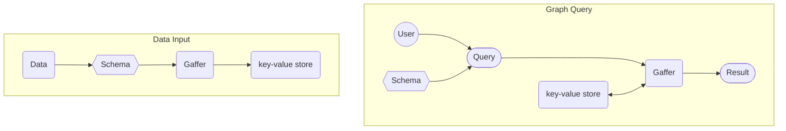

# What is Gaffer?

Gaffer is a graph database framework, it acts similarly to an interface providing a graph data
structure on top of a chosen storage technology to enable storage of large graphs and traversal of
it's nodes and edges. In a nutshell Gaffer allows you to take data, convert it into a graph, store it
in a database and then run queries and analytics on it.

The high level interactions of loading data and querying are demonstrated in the diagrams below.

