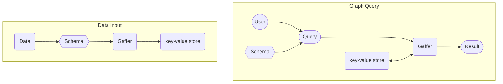

# What is Gaffer?

Gaffer is a graph database framework, it acts similarly to an interface
providing a graph data structure on top of a chosen storage technology to enable
storage of large graphs and traversal of it's nodes and edges. In a nutshell
Gaffer allows you to take data, convert it into a graph, store it in a database
and then run queries and analytics on it.

The high level interactions of loading data and querying are demonstrated in the
diagrams below.

## Why would you want to use Gaffer?

Conceptually a graph database/data platform can have a large variety of uses
where it'll provide specific advantages over other data storage/analytic
platforms which will be discussed in the ["What is Graph?"](./what-is-a-graph.md)
section of these docs. Gaffer provides an extensible and straightforward way to
insert, manage and query the graph data stored in the underlying storage systems
(ie. Accumulo) that is native to the community.

Gaffer also has some key features not always found in other graph database
technologies, including but not limited to:

- [Aggregation](./what-is-aggregation.md).
- [Fine grained security](../../administration-guide/security/security-guide.md).
- Enhanced scalability and data throughput.
