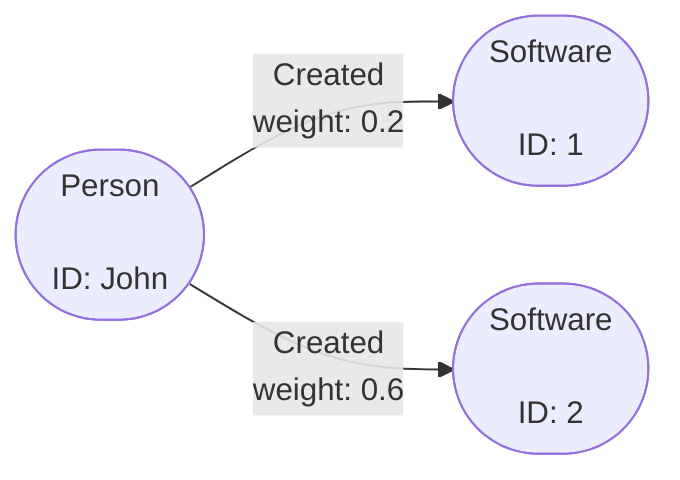
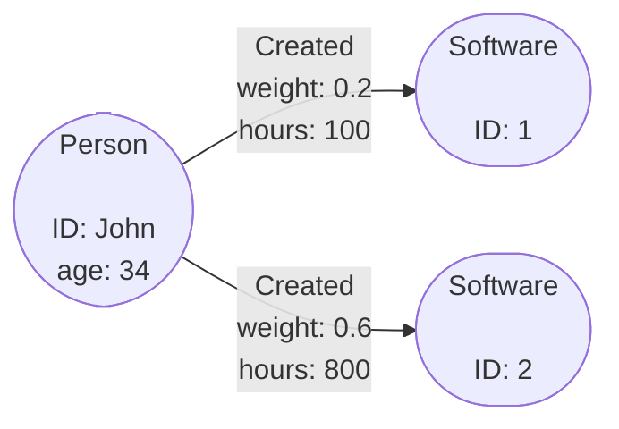

# Filtering Data

One of the key parts of querying data is being able to filter out bits you may
not want. This page will cover some of the common ways you can filter the
returned data from an Operation to get the data you want.

In Gaffer the main way you filter data is by applying whats known as a `View` to
a returned set of elements. A `View`, as the name suggests, allows you to view
the data in a different way; this can be either via a filter, aggregation,
transformation or just general manipulation of the results.

Use cases with a `View` usually fall into one of the following catagories:

- **Filtering** - General filtering on elements based on predicates. Filtering
    can be applied pre-aggregation, post aggregation and post transformation.

- **Aggregation** - This is to control how similar elements are aggregated
    together. You can provide a subset of the schema `groupBy` properties and
    override existing aggregation functions.

- **Transformation** - Transformations can be applied by providing Functions to
    transform properties and vertex values. This is a powerful feature, you can
    override the existing values or you can transform and save the new value
    into a new transient property.

- **Property Removal** - The relevant properties you want to be returned can be
    controlled. You can use either `properties` or `excludeProperties` to define
    the list of properties to be included or excluded.

## Filtering in Practice

We will demonstrate general filtering on a query. Take the following graph as a
basic example, where we have a `Person` node with ID `John` that has a few
`Created` edges with a `weight` property on them.



Lets say the `weight` property represents how much a `Person` contributed to
creating something and that we wanted to only find the most significant
contributions. To do this we can apply a filter to act as a threshold to only
get edges with a `weight` more than a specific value.

First we use a simple query to get the node with ID `John` and any edges
associated with it. Then we can apply a filter to include only edges where the
`weight` property is over a certain value.

!!! example ""
    In this scenario it is analogous to asking, *"Get all the `Created` edges on
    node `John` that have a `weight` greater than 0.4"*.

    === "Java"

        ```java
        // Define the View to use
        final View viewWithFilters = new View.Builder()
            .edge("Created", new ViewElementDefinition.Builder()
                    .preAggregationFilter(new ElementFilter.Builder()
                            .select("weight")
                            .execute(new IsMoreThan(0.4))
                            .build())
                    .build())
            .build();

        // Create the operation to execute
        final GetElements operation = new GetElements.Builder()
            .input(new EntitySeed("John"))
            .view(viewWithFilters)
            .build();

        graph.execute(operation, user);
        ```

    === "JSON"

        ```json
        {
            "class": "GetElements",
            "input": [
                {
                    "class": "EntitySeed",
                    "vertex": "John"
                }
            ],
            "view": {
                "edges": {
                    "Created": {
                        "preAggregationFilterFunctions": [
                            {
                                "selection": [
                                    "weight"
                                ],
                                "predicate": {
                                    "class": "IsMoreThan",
                                    "orEqualTo": false,
                                    "value": {
                                        "Float": 0.4
                                    }
                                }
                            }
                        ]
                    }
                }
            }
        }
        ```

    === "Python"

        ```python
        elements = gc.execute_operation(
            operation = g.GetElements(
                input = [g.EntitySeed(vertex = "John")]
                view = g.View(
                    edges = [
                        g.ElementDefinition(
                            group = 'Created',
                            pre_aggregation_filter_functions = [
                                g.PredicateContext(
                                    selection = ['weight'],
                                    predicate = g.IsMoreThan(
                                        value = {'java.lang.Float': 0.4},
                                        or_equal_to = False
                                    )
                                )
                            ]
                        )
                    ]
                )
            )
        )
        ```

    Results:

    === "Java"
        ```java
        Edge[source="John",destination=2,directed=true,matchedVertex=SOURCE,group=Created,properties=Properties[weight=<java.lang.Float>0.6]]
        ```

    === "JSON"
        ```json
        [
            {
                "class": "uk.gov.gchq.gaffer.data.element.Edge",
                "group": "Created",
                "source": "John",
                "destination": "2",
                "directed": true,
                "matchedVertex": "SOURCE",
                "properties": {
                    "weight": 0.6
                }
            }
        ]
        ```

To form relevant filters and queries it is usually required that you know the
graph schema in use. The schema determines what properties and elements you can
reference in your queries and the general structure of the data in the graph.
For an introduction and background on Gaffer schemas [please see the guide](../../schema.md).

!!! tip
    As you can see filtering is based around predicates which are similar to if
    else statements in traditional programming. For a full list of available
    predicates refer to the [reference documentation](../../../reference/predicates-guide/predicates.md).

### Filtering Properties

If you are only interested in specific properties then it is more efficient to
tell Gaffer to only return those properties. This can be easily achieved by
applying the `properties` or `excludeProperties` field to a `View`.

If we take a similar example to before but instead add a couple of properties
to both the `Person` and `Created` elements to give a graph like the following:



Now as before we can run a query on this graph to get the elements relevant to
the `Person` node. However, this time we will filter so that only specific
properties are returned.

!!! example ""
    Here we are asking to only include the `hours` property from the `Created`
    edges in the output, and specifically excluding the `age` property from any
    returned `Person` entities.

    === "Java"

        ```java
        // Define the View to use
        final View viewWithFilters = new View.Builder()
            .edge("Created", new ViewElementDefinition.Builder()
                    .properties("hours")
                    .build())
            .entities("Person", new ViewElementDefinition.Builder()
                    .excludeProperties("age")
                    .build())
            .build();

        // Create the operation to execute
        final GetElements operation = new GetElements.Builder()
            .input(new EntitySeed("John"))
            .view(viewWithFilters)
            .build();

        graph.execute(operation, user);
        ```

    === "JSON"

        ```json
        {
            "class": "GetElements",
            "input": [
                {
                    "class": "EntitySeed",
                    "vertex": "John"
                }
            ],
            "view": {
                "edges": {
                    "Created": {
                        "properties" : [ "hours" ]
                    }
                },
                "entities" : {
                    "Person" : {
                        "excludeProperties" : [ "age" ]
                    }
                }
            }
        }
        ```

    === "Python"

        ```python
        elements = gc.execute_operation(
            operation = g.GetElements(
                input = [g.EntitySeed(vertex = "John")]
                view = g.View(
                    edges = [
                        g.ElementDefinition(
                            group = 'Created',
                            properties = [ "hours" ]
                        )
                    ]
                    entities = [
                        g.ElementDefinition(
                            group = 'Person',
                            exclude_properties = [ "age" ]
                        )
                    ]
                )
            )
        )
        ```
    Results:

    === "Java"
        ```java
        Edge[source="John",destination=2,directed=true,matchedVertex=SOURCE,group=Created,properties=Properties[hours=<java.lang.Integer>800]]
        Edge[source="John",destination=1,directed=true,matchedVertex=SOURCE,group=Created,properties=Properties[hours=<java.lang.Integer>100]]
        Entity[vertex="John",group=Person,properties=Properties[]]
        ```
    === "JSON"
        ```json
        [
            {
                "class": "uk.gov.gchq.gaffer.data.element.Edge",
                "group": "Created",
                "source": "John",
                "destination": "2",
                "directed": true,
                "matchedVertex": "SOURCE",
                "properties": {
                    "hours": 800
                }
            },
            {
                "class": "uk.gov.gchq.gaffer.data.element.Edge",
                "group": "Created",
                "source": "John",
                "destination": "1",
                "directed": true,
                "matchedVertex": "SOURCE",
                "properties": {
                    "hours": 100
                }
            },
            {
                "class": "uk.gov.gchq.gaffer.data.element.Entity",
                "group": "Person",
                "vertex": "John",
                "properties": {}
            }
        ]
        ```

### Filtering by Element Type

You can use Views to filter the element types returned from your query. So, if you
only wanted edges returned you can use `allEdges(true)` in a View or if you only wanted
entities then use `allEntities(true)`.

This essentially works by getting all the Schema groups for the edges or entities and
adding them to the view, e.g. `entity(getSchema().getEntityGroups())`.

!!! example ""
    Filter which will return only entities from the query.

    === "Java"

        ``` java
        final GetAllElements operation = new GetAllElements()
                .view(new View.Builder()
                    .allEntities(true)
                    .build())
                .build();
        ```

    === "JSON"

        ``` json
        {
          "class" : "GetAllElements",
          "view": {
            "allEntities": true
          }
        }
        ```

    === "Python"

        ``` python
        g.GetAllElements(
            view=g.View(
                all_entities=True
            )
        )
        ```

    Results:

    === "Java"
        ```java
        Entity[vertex="John",group=Person,properties=Properties[age=<java.lang.Integer>34]]
        Entity[vertex="1",group=Software,properties=Properties[]]
        Entity[vertex="2",group=Software,properties=Properties[]]
        ```

    === "JSON"
        ```json
        [
            {
                "class": "uk.gov.gchq.gaffer.data.element.Entity",
                "group": "Person",
                "vertex": "John",
                "properties": {}
            },
            {
                "class": "uk.gov.gchq.gaffer.data.element.Entity",
                "group": "Software",
                "vertex": "1",
                "properties": {}
            },
            {
                "class": "uk.gov.gchq.gaffer.data.element.Entity",
                "group": "Software",
                "vertex": "2",
                "properties": {}
            }
        ]
        ```

!!! example ""
    Filter which will return only the edges from the query.

    === "Java"

        ``` java
        final GetAllElements operation = new GetAllElements()
                .view(new View.Builder()
                    .allEdges(true)
                    .build())
                .build();
        ```

    === "JSON"

        ``` json
        {
          "class" : "GetAllElements",
          "view": {
            "allEdges": true
          }
        }
        ```

    === "Python"

        ``` python
        g.GetAllElements(
            view=g.View(
                all_edges=True
            )
        )
        ```

    Results:

    === "Java"
        ```java
            Edge[source="John",destination=2,directed=true,matchedVertex=SOURCE,group=Created,properties=Properties[weight=<java.lang.Float>0.6,hours=<java.lang.Integer>800,minutes=<java.lang.Integer>48000]]
            Edge[source="John",destination=1,directed=true,matchedVertex=SOURCE,group=Created,properties=Properties[weight=<java.lang.Float>0.2,hours=<java.lang.Integer>100,minutes=<java.lang.Integer>6000]]
        ```

    === "JSON"
        ```json
        [
            {
            "class": "uk.gov.gchq.gaffer.data.element.Edge",
            "group": "Created",
            "source": "John",
            "destination": "2",
            "directed": true,
            "matchedVertex": "SOURCE",
            "properties": {
                "weight": 0.2,
                "hours": 800,
                "minutes": 48000
            }
            },
            {
                "class": "uk.gov.gchq.gaffer.data.element.Edge",
                "group": "Created",
                "source": "John",
                "destination": "1",
                "directed": true,
                "matchedVertex": "SOURCE",
                "properties": {
                    "weight": 0.6,
                    "hours": 100,
                    "minutes": 6000
                }
            }
        ]
        ```

!!! warning
    Users should not use this filter in conjunction with a `GetAdjacentIds` opeation as this
    already only returns entities and results may not be returned correctly.

### Global View Definitions

If you wish to use the same filter on multiple groups, you could use a global `View` definition.
These include:

- `globalElements` - these are applied to all edges and entities.
- `globalEdges` - these are applied to all edges.
- `globalEntities` - these are applied to all entities.

Global aggregations and transformations work in a similar way to filtering.
Properties can be included/excluded globally using filtering.
These examples show including global properties in the filter, excluded global properties work in a similar fashion.

!!! example ""

    If we only wanted to return the `weight` property for all elements this
    can be done as follows:

    === "Java"

        ```java
        // Define the View to use
        final View viewWithGlobalFilter = new View.Builder()
            .globalElements(new GlobalViewElementDefinition.Builder()
                .properties("weight")
                .build())
            .build();
        ```

    === "JSON"

        ```json
        {
            "view": {
                "globalElements": [ {
                    "properties": ["weight"]
                }]
            }
        }
        ```

    === "Python"

        ```python
        viewWithGlobalElements = g.View(
            global_elements=[
                g.GlobalElementDefinition(
                    properties=["weight"]
                ),
            ],
            all_edges=False,
            all_entities=False
        )
        ```

Global View definitions can also be used to filter all elements for specific properties.

!!! example ""

    If we want all elements with a `weight` more than 0.4.

    === "Java"

        ```java
        // Define the View to use
        final View viewWithGlobalFilter = new View.Builder()
            .globalElements(new GlobalViewElementDefinition.Builder()
                .postAggregationFilter(new ElementsFilter.Builder()
                    .select("weight")
                    .execute(new IsMoreThan(0.4))
                    .build())
                .build())
            .build();
        ```

    === "JSON"

        ```json
        {
            "view": {
                "globalElements" : [ {
                    "postAggregationFilterFunctions" : [ {
                        "selection" : [ "weight" ],
                        "predicate" : {
                            "class" : "IsMoreThan",
                            "orEqualTo" : false,
                            "value" : {
                                "Float" : 0.4
                            }
                        }
                    } ]
                } ]
            }
        }
        ```

    === "Python"

        ```python
        viewWithGlobalElements = g.View(
            global_elements=[
                g.GlobalElementDefinition(
                    post_aggregation_filter_functions=[
                        g.PredicateContext(
                            selection=["weight"],
                            predicate=g.IsMoreThan(
                                value={'java.lang.Float': 0.4},
                                or_equal_to=False
                            )
                        )
                    ]
                )
            ],
            all_edges=False,
            all_entities=False
        )
        ```

In addition to global definitions, you can add specific view definitions to different element
groups as you would usually. The global definitions are then merged with each of the element
specific filters using an AND operator.

!!! example ""

    In this example this would get all `Commit` edges with a `weight` property
    as well as all `Person` entities with an `age` property.

    === "Java"

        ```java
        // Define the View to use
        final View globalAndSpecificFilter = new View.Builder()
                .globalElements(new GlobalViewElementDefinition.Builder()
                    .properties("weight")
                    .build())
                .edge("Commit")
                .entity("Person", new ViewElementDefinition.Builder()
                    .properties("age")
                    .build())
            .build();
        ```

    === "JSON"

        ```json
        {
            "view": {
                "edges" : {
                    "Commit" : { }
                },
                "entities" : {
                    "Person" : {
                        "properties" : [ "age" ]
                    }
                },
                "globalElements" : [ {
                    "properties" : [ "weight" ]
                } ]
            }
        }
        ```

    === "Python"

        ```python
        globalAndSpecificFilter = g.View(
            entities=[
                g.ElementDefinition(
                    group="Person",
                    properties=["age"]
                )
            ],
            edges=[
                g.ElementDefinition(
                    group="Commit"
                )
            ],
            global_elements=[
                g.GlobalElementDefinition(
                    properties=["weight"]
                )
            ],
            all_edges=False,
            all_entities=False
        )
        ```

## Transformation

It is possible to apply a transformation to the output of a query which then
gives you the opportunity to manipulate the results into a more useful output.

When a transform is applied the new results are saved into what is known as a
transient property. A transient property is just a property that is not
persisted; simply created at query time by a transform function.

To use a transform you must use a transform function, this is a Java class
that extends the [`java.util.Function`](https://docs.oracle.com/javase/8/docs/api/java/util/function/Function.html)
class to take some input and give a new output. Commonly you would want to
write your own transform function class as it can be quite specific to your
graph data and what analytics you want to get out of it. However, the
[Koryphe module](../../../reference/functions-guide/koryphe-functions.md)
(included by default with Gaffer) provides some default functions you can
make use of.

As an example of transformation we will use the same graph from the [previous
section](#filtering-properties) to transform the `hours` property into minutes
and save the returned information into a new `minutes` transient property.

!!! example ""
    Here you can see we select the inputs for the function as the `"hours"`
    property we then use the `MultiplyBy` Koryphe function to transform a
    property and project the result into a transient property named `"minutes"`.

    === "Java"

        ```java
        final GetElements getEdgesWithMinutes = new GetElements.Builder()
            .input(new EntitySeed("John"))
            .view(new View.Builder()
                    .edge("Created", new ViewElementDefinition.Builder()
                            .transientProperty("minutes", Integer.class)
                            .transformer(new MultiplyBy(60))
                            .build())
                    .build())
            .build();

        graph.execute(getEdgesWithMinutes, user);
        ```

    === "JSON"

        ```json
        {
            "class": "GetElements",
            "input": [
                {
                    "class": "EntitySeed",
                    "vertex": "John"
                }
            ],
            "view": {
                "edges": {
                    "Created": {
                        "transientProperties" : {
                            "minutes" : "java.lang.Integer"
                        },
                        "transformFunctions" : [
                            {
                                "selection" : [ "hours" ],
                                "function" : {
                                    "class" : "MultiplyBy",
                                    "by" : 60
                                },
                                "projection" : [ "minutes" ]
                            }
                        ]
                    }

                }
            }
        }
        ```

    === "Python"

        ```python
        elements = gc.execute_operation(
            operation = g.GetElements(
                input = [g.EntitySeed(vertex = "John")]
                view = g.View(
                    edges = [
                        g.ElementDefinition(
                            group = 'Created',
                            transient_properties = {'minutes': 'java.lang.Integer'},
                            transform_functions = [
                                g.FunctionContext(
                                    selection = [ "hours" ],
                                    function = g.MultiplyBy(by = 60),
                                    projection = [ "minutes" ]
                                )
                            ]
                        )
                    ]
                )
            )
        )
        ```
    Results:

    === "Java"
        ```java
        Edge[source="John",destination=2,directed=true,matchedVertex=SOURCE,group=Created,properties=Properties[weight=<java.lang.Float>0.6,hours=<java.lang.Integer>800,minutes=<java.lang.Integer>48000]]
        Edge[source="John",destination=1,directed=true,matchedVertex=SOURCE,group=Created,properties=Properties[weight=<java.lang.Float>0.2,hours=<java.lang.Integer>100,minutes=<java.lang.Integer>6000]]
        Entity[vertex="John",group=Person,properties=Properties[age=<java.lang.Integer>34]]
        ```
    === "JSON"
        ```json
        [
            {
                "class": "uk.gov.gchq.gaffer.data.element.Edge",
                "group": "Created",
                "source": "John",
                "destination": "2",
                "directed": true,
                "matchedVertex": "SOURCE",
                "properties": {
                    "weight": 0.2,
                    "hours": 800,
                    "minutes": 48000
                }
            },
            {
                "class": "uk.gov.gchq.gaffer.data.element.Edge",
                "group": "Created",
                "source": "John",
                "destination": "1",
                "directed": true,
                "matchedVertex": "SOURCE",
                "properties": {
                    "weight": 0.6,
                    "hours": 100,
                    "minutes": 6000
                }
            },
            {
                "class": "uk.gov.gchq.gaffer.data.element.Entity",
                "group": "Person",
                "vertex": "John",
                "properties": {
                    "age": 34
                }
            }
        ]
        ```

The `selection` in a transform is similar to the way we select properties and
identifiers in a filter and as demonstrated you can select (and also project)
any property but also any of these unique identifiers:

- `VERTEX` - This is the vertex on an Entity.
- `SOURCE` - This is the source vertex on an Edge.
- `DESTINATION` - This is the destination vertex on an Edge.
- `DIRECTED` - This is the directed field on an Edge.
- `MATCHED_VERTEX` - This is the vertex that was matched in the query, either
  the `SOURCE` or the `DESTINATION`.
- `ADJACENT_MATCHED_VERTEX` - This is the adjacent vertex that was matched in
  the query, either the `SOURCE` or the `DESTINATION`. For example, if your seed
  matches the source of the edge this would resolve to the `DESTINATION` value.

## Query-time Aggregation

Gaffer allows grouping results together based on their properties to form a new
result, this is known as aggregation. Aggregation can be applied at both data
ingest or query-time, this guide will focus on the latter but an overview of
both techniques is available in the [gaffer basics
guide](../../gaffer-basics/what-is-aggregation.md).

Generally to apply aggregation at query-time you must override what is known as
the `groupBy` property to create your own aggregator in the query. To demonstrate
this we will use the following example graph.

!!! example ""
    A simple graph representing commits by a `Person` to a `Repository` with
    each `Commit` being an edge with properties for the lines `added` and
    `removed`.

    ```mermaid
    graph LR
        A(["Person

            ID: John"])
        --
        "Commit
         added: 10
         removed: 3"
        -->
        B(["Repository

            ID: 1"])
        A
        --
        "Commit
         added: 3
         removed: 5"
        -->
        B
    ```

We will use aggregation to group the properties of the `Commit` edges to get a
total for all the `added` and `removed` properties.

!!! example ""
    Usually a result would contain all the edges on the `Person` node but instead
    we have applied aggregation so the result will contain an element with
    a `Sum` of all the `added` and `removed` properties.

    === "Java"

        ```java
        final GetElements getEdgesAggregated = new GetElements.Builder()
            .input(new EntitySeed("John"))
            .view(new View.Builder()
                    .edge("Commit", new ViewElementDefinition.Builder()
                            .groupBy()
                            .aggregator(new ElementAggregator.Builder()
                                .select(["added", "removed"])
                                .execute(new Sum())
                                .build()))
                    .build())
            .build();

        graph.execute(getEdgesAggregated, user);
        ```

    === "JSON"

        ```json
        {
            "class": "GetElements",
            "input": [
                {
                    "class": "EntitySeed",
                    "vertex": "John"
                }
            ],
            "view": {
                "edges": {
                    "Commit": {
                        "groupBy" : [ ],
                        "aggregator" : {
                            "operators" : [
                                {
                                    "selection" : [ "added", "removed" ],
                                    "binaryOperator" : {
                                        "class" : "Sum"
                                    }
                                }
                            ]
                        }
                    }

                }
            }
        }
        ```

    === "Python"

        ```python
        elements = gc.execute_operation(
            operation = g.GetElements(
                input = [g.EntitySeed(vertex = "John")],
                view = g.View(
                    edges = [
                        g.ElementDefinition(
                            group = 'Commit',
                            group_by = [],
                            aggregate_functions = [
                                g.BinaryOperatorContext(
                                    selection=[ "added", "removed" ],
                                    binary_operator = g.Sum()
                                )
                            ]
                        )
                    ]
                )
            )
        )
        ```
    Results:

    === "Java"
        ```java
        Edge[source="John",destination=1,directed=true,matchedVertex=SOURCE,group=Commit,properties=Properties[added=<java.lang.Integer>13,removed=<java.lang.Integer>8]]
        Entity[vertex="John",group=Person,properties=Properties[]]
        ```
    === "JSON"
        ```json
        [
            {
                "class": "uk.gov.gchq.gaffer.data.element.Edge",
                "group": "Commit",
                "source": "John",
                "destination": "1",
                "directed": true,
                "matchedVertex": "SOURCE",
                "properties": {
                    "added": 13,
                    "removed": 8
                }
            },
            {
                "class": "uk.gov.gchq.gaffer.data.element.Entity",
                "group": "Person",
                "vertex": "John",
                "properties": {}
            }
        ]
        ```

### Summarisation

Elements in Gaffer are often stored in daily time buckets; this allows users to
query a summary of the elements that occurred on a particular day. For example,
a count of the commits John made to the repository on the first of the month.
The daily time buckets are controlled by using the `groupBy` properties.

You can get edges with the same source and destination aggregrated together,
regardless of any dates. This is achieved by overriding the `groupBy` field
with an empty array which tells Gaffer not to group by any properties
and to instead summarise all elements, e.g. all John committed to repo edges.

!!! example ""

    So, we can add a timestamp to John's commit data:
    ```
        Commit, John, 1, 2024-05-01 10:00:00
        Commit, John, 1, 2024-05-01 11:00:00
        Commit, John, 1, 2024-05-04 09:30:00
        Commit, John, 1, 2024-05-10 10:00:00
        Commit, John, 1, 2024-05-10 16:50:00
    ```
    Then an empty `groupBy` tells Gaffer to not group by any properties and
    to just summarise all John's commits, regardless of date.

    === "Java"

        ```java
        final GetElements getEdgesSummarised = new GetElements.Builder()
            .input(new EntitySeed("John"))
            .view(new View.Builder()
                    .edge("Commit", new ViewElementDefinition.Builder()
                            .groupBy()
                            .build())
                    .build())
            .build();
        ```

    === "JSON"

        ```json
        {
            "class": "GetElements",
            "input": [
                {
                    "class": "EntitySeed",
                    "vertex": "John"
                }
            ],
            "view": {
                "edges": {
                    "Commit": {
                        "groupBy" : [],
                    }

                }
            }
        }
        ```

    === "Python"

        ```python
        elements = gc.execute_operation(
            operation = g.GetElements(
                input = [g.EntitySeed(vertex = "John")],
                view = g.View(
                    edges = [
                        g.ElementDefinition(
                            group = 'Commit',
                            group_by = []
                        )
                    ]
                )
            )
        )
        ```

    Result:

    === "Java"
        ```java
        Edge[source="John",destination=1,directed=true,matchedVertex=SOURCE,group=Commit,properties=Properties[date=<java.util.Date>Wed May 01 00:00:00 UTC 2024, count=<java.lang.Long>5]]
        ```

If you apply some pre-aggregation filtering, you can also select a time window to aggregate over.

!!! example ""

    Gets all `Commit` edges that fall within a certain time window and filters out
    other edges.

    === "Java"

        ```java
        final GetElements getEdgeSummarisedInTimeWindow = new GetElements.Builder()
            .input(new EntitySeed("John"))
            .view(new View.Builder()
                    .edge("Commit", new ViewElementDefinition.Builder()
                         .preAggregationFilter(new ElementFilter.Builder()
                                .select("date")
                                .execute(new InDateRange.Builder()
                                    .start("2024/05/01")
                                    .end("2024/05/03")
                                    .startInclusive(true)
                                    .endInclusive(false)
                                .build()))
                            .groupBy()
                            .build())
                    .build())
            .build();
        ```

    === "JSON"

        ```json
        {
            "class": "GetElements",
            "input": [
                {
                    "class": "EntitySeed",
                    "vertex": "John"
                }
            ],
            "view": {
                "edges": {
                    "Commit": {
                        "groupBy" : [ ],
                        "preAggregationFilterFunctions": [{
                            "selection" : ["date"],
                            "predicate" : {
                                "class" : "InDateRange",
                                "start" : "2024/05/01",
                                "end" : "2024/05/03",
                                "startInclusive": true,
                                "endInclusive": false
                            }
                        }]
                    }

                }
            }
        }
        ```

    === "Python"

        ```python
        elements = c.execute_operation(
            operation = g.GetElements(
                input = [g.EntitySeed(vertex = "John")],
                view = g.View(
                    edges = [
                        g.ElementDefinition(
                            group = 'Commit',
                            group_by = [],
                            pre_aggregation_filter_functions=[
                                g.PredicateContext(
                                    predicate=g.Or(
                                        predicates=[
                                            g.InDateRange(
                                                start="2024/05/01",
                                                end="2024/05/03",
                                                start_inclusive=True,
                                                end_inclusive=False
                                            )
                                        ]
                                    )
                                )
                            ]
                        )
                    ]
                )
            )
        )
        ```

    Result:

    === "Java"
        ```java
        Edge[source="John",destination=1,directed=true,matchedVertex=SOURCE,group=Commit,properties=Properties[date=<java.util.Date>Wed May 01 00:00:00 UTC 2024, count=<java.lang.Long>2]]
        ```

There is also a more advanced feature of query-time aggregation which allows you to override
the logic of how Gaffer aggregates properties. For example, by default the count property is aggregated
with Sum, as above, but at query time you can force the count to be aggregated using another operator,
e.g. the [Min](../../../reference/binary-operators-guide/koryphe-operators.md#min) operator. This would allow you to find things such as the minimum daily count.
This feature does not affect any of the persisted values and any ingest aggregation that has already
occurred will not be modified.

!!! example ""

    This asks at query time what was the minimum `added` by John on one of his commits
    between two dates. This is done by adding an extra 'aggregator' to the operation View.

    === "Java"

        ```java
        final GetAllElements edgesSummarisedInTimeWindowWithMinCountOperation = new GetAllElements.Builder()
            .view(new View.Builder()
                .edge("Commit", new ViewElementDefinition.Builder()
                    .preAggregationFilter(new ElementFilter.Builder()
                        .execute(new InDateRange.Builder()
                            .start("2024/05/01")
                            .end("2024/05/05")
                            .startInclusive(true)
                            .endInclusive(false)
                        .build()))
                    .groupBy()
                    .aggregator(new ElementAggregator.Builder()
                            .select("added")
                            .execute(new Min())
                            .build())
                    .build())
            .build())
        .build();
        ```

    === "JSON"

        ```json
        {
            "class" : "GetAllElements",
            "view" : {
                "edges" : {
                    "Commit" : {
                        "preAggregationFilterFunctions" : [ {
                            "selection" : [ "date" ],
                            "predicate" : {
                                "class" : "InDateRange",
                                "start" : "2024/05/01",
                                "end" : "2024/05/05",
                                "startInclusive": true,
                                "endInclusive": false
                            }
                        }],
                        "groupBy" : [ ],
                        "aggregator" : {
                            "operators" : [ {
                                "selection" : [ "added" ],
                                "binaryOperator" : {
                                "class" : "uk.gov.gchq.koryphe.impl.binaryoperator.Min"
                                }
                            } ]
                        }
                    }
                }
            }
        }
        ```

    === "Python"

        ```python
         elements = gc.execute_operation(
            operation = g.GetElements(
                input = [g.EntitySeed(vertex = "John")],
                view = g.View(
                    edges = [
                        g.ElementDefinition(
                            group = 'Commit',
                            group_by = [],
                            pre_aggregation_filter_functions=[
                                g.PredicateContext(
                                    predicate=g.Or(
                                        predicates=[
                                            g.InDateRange(
                                                start="2024/05/01",
                                                end="2024/05/05",
                                                start_inclusive=True,
                                                end_inclusive=False
                                            )
                                        ]
                                    )
                                )
                            ],
                            aggregate_functions = [
                                g.BinaryOperatorContext(
                                    selection=["added"],
                                    binary_operator = g.Min()
                                )
                            ]
                        )
                    ]
                )
            )
        )
        ```

More commonly, you will want to set the groupBy to empty for all groups in your schema.
This can be done using the `globalElements` section in the view:

!!! example ""

    === "Java"

        ```java
        final GetElements getEdgesSummarised = new GetElements.Builder()
            .input(new EntitySeed("John"))
            .view(new View.Builder()
                    .globalElements(new GlobalViewElementDefinition.Builder()
                            .groupBy()
                            .build())
                    .build())
            .build();
        ```

    === "JSON"

        ```json
        {
            "class": "GetElements",
            "input": [
                {
                    "class": "EntitySeed",
                    "vertex": "John"
                }
            ],
            "view": {
                "globalElements": {
                    "groupBy" : []
                }
            }
        }
        ```
    === "Python"

        ```python
        elements = gc.execute_operation(
            operation = g.GetElements(
                input = [g.EntitySeed(vertex = "John")],
                view = g.View(
                    global_elements = g.GlobalViewElementDefinition(
                        group_by = []
                    )
                )
            )
        )
        ```

!!! tip
    As with some of the other examples we again use a class from the Koryphe
    module to help with the aggregation, please see the [reference
    material](../../../reference/binary-operators-guide/koryphe-operators.md)
    for a full list and examples.
