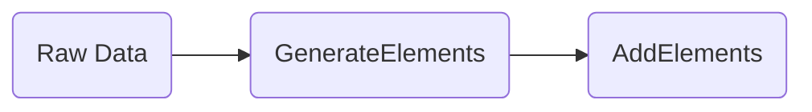

# CSV Data Import and Export

Gaffer supports both importing from and exporting to csv. This page will outline
some of the common methods you can use to do this via the API.

## Using Local Files

If you configure your Gaffer graph to support the `ImportFromLocalFile` and
`ExportToLocalFile` operations, then it can do this from/to a local file. To
enable these operations you will need to use a JSON configuration file to
specify the operations and their handlers like so:

```json
{
    "operations": [
        {
            "operation": "uk.gov.gchq.gaffer.operation.impl.export.localfile.ImportFromLocalFile",
            "handler": {
                "class": "uk.gov.gchq.gaffer.store.operation.handler.export.localfile.ImportFromLocalFileHandler"
            }
        },
        {
            "operation": "uk.gov.gchq.gaffer.operation.impl.export.localfile.ExportToLocalFile",
            "handler": {
                "class": "uk.gov.gchq.gaffer.store.operation.handler.export.localfile.ExportToLocalFileHandler"
            }
        }
    ]
}
```

Usually this file is called `operationsDeclarations.json` but the name can be
anything, what is important is that the file is specified in your store
properties file by using the following property:

```properties
gaffer.store.operation.declarations=/gaffer/store/operationsDeclarations.json
```

## How to Import and Export

You can use the rest API to add the graph elements. In production this method
would not be recommended for large volumes of data. However, it is fine for
smaller data sets and generally can be done in a few stages outlined in the
following diagram.



The operation chain below essentially mirrors the stages in the previous
diagram. The first stage is taking the raw input data and converting it into
Gaffer elements via an element generator class. Gaffer includes a few built in
[generators](../../reference/operations-guide/generate.md) but you can use a
custom class or pre-process the data before passing to Gaffer so that you're
able to use a default generator. Once the data has been converted to elements it
needs to be added into the graph. To load elements there is a standard
`AddElements` operation which takes raw elements JSON as input and adds them
into the graph.

!!! tip
    See [the page covering Operations](../operations.md) for an introduction on
    how to use them via the API.

```json
{
    "class": "OperationChain",
    "operations": [
        {
            "class": "ImportFromLocalFile", //(1)!
            "filePath": "mydata.csv"
        },
        {
            "class": "GenerateElements", //(2)!
            "elementGenerator": {
                "class": "Neo4jCsvElementGenerator"
            }
        },
        {
            "class": "AddElements" //(3)!
        }
    ]
}
```

1. The `ImportFromLocalFile` operation reads each line from the file
   `mydata.csv` and will stream each string into the next parts of the chain.
2. The `GenerateElements` operation will transform each line of the file into a
   Gaffer Element. You will need to provide an element generator that is
   suitable for the file you have provided. The two `CsvElementGenerators`
   provided in core Gaffer are [`Neo4jElementGenerator`](#neo4j-format) and
   [`NeptuneCsvElementGenerator`](#neptune-format).
3. Finally, the stream of Gaffer Elements are added with an `AddElements`
   operation.

Exporting to csv is done with a similar OperationChain.

```json
{
    "class": "OperationChain",
    "operations": [
        {
            "class": "GetAllElements" //(1)!
        },
        {
            "class": "ToCsv", //(2)!
            "csvGenerator": "Neo4jCsvGenerator"
        },
        {
            "class": "ExportToLocalFile", //(3)!
            "filePath": "output.csv"
        }
    ]
}
```

1. Firstly, you need to get the Elements which you want to export, in this
   example we simply `GetAllElements`.
2. The `ToCsv` operation is then used to turn each Element into a csv formatted
   string. You must supply a `CsvGenerator` to do this. You can build a custom
   [`CsvGenerator`](#custom-formats), or use a supplied one. The two
   `CsvGenerators` provided in core Gaffer are
   [`Neo4jCsvGenerator`](#neo4j-format) and
   [`NeptuneCsvGenerator`](#neptune-format).
3. Then the `ExportToLocalFile` operation is used to save this string output
   into a local file.

## Formats

### Custom formats

Currently, custom formats for import are not supported. Instead you should use
one of the two [OpenCypher formats](#opencypher-formats). However, for export
you can customise the `CsvGenerator` class to create a custom export format in a
`ToCsv` operation. For example, the following operation.

```json
{
    "class": "ToCsv",
    "csvGenerator": {
        "class": "CsvGenerator",
        "fields": ["prop1", "SOURCE", "DESTINATION", "prop2", "GROUP"],
        "constants": ["constant1", "constant2"]
    }
}
```

Would produce csv rows that look like:

=== "Table"
    | prop1Value | sourceValue | destinationValue | prop2 | groupValue | constant1 | constant2 |
    | ---------- | ----------- | ---------------- | ----- | ---------- | --------- | --------- |

=== "CSV"
    ```csv
    prop1Value,sourceValue,destinationValue,prop2,groupValue,constant1,constant2
    ```

### OpenCypher Formats

Core Gaffer has some generators provided that can import from and export to
OpenCypher CSV. These will work with other graph databases like Neo4j and
Neptune.

!!! note
    Please note that when using these, Gaffer might change your property name
    headers. All instances of `-` are replaced with `_`, and invalid characters
    are stripped as outlined in [PropertiesUtil](https://github.com/gchq/Gaffer/blob/f16de7c3eccfe7a800cad1d7eea5fbae4cf01d44/core/common-util/src/main/java/uk/gov/gchq/gaffer/commonutil/PropertiesUtil.java#L26).

As shown [later in the examples](#neo4j-format), OpenCypher formats let you
dictate property types in the header, like `propertyName:type`. Below is a table
that shows which Gaffer transform function is used to deserialise each
[OpenCypher data
type](https://docs.aws.amazon.com/neptune/latest/userguide/bulk-load-tutorial-format-opencypher.html#bulk-load-tutorial-format-opencypher-data-types)
during import.

| Gaffer Transform Function | OpenCypher Data Types                                                 |
| ------------------------- | --------------------------------------------------------------------- |
| `ToString`                | `String` `Char` `Duration` `Point` `Date` `LocalDate` `LocalDateTime` |
| `ToBoolean`               | `Bool` `Boolean`                                                      |
| `ToInteger`               | `Int` `Short` `Byte`                                                  |
| `ToLong`                  | `Long`                                                                |
| `ToFloat`                 | `Float`                                                               |
| `ToDouble`                | `Double`                                                              |
| `ParseTime`               | `DateTime`                                                            |

## Neo4j Generators

You can import CSV from Neo4j using the `Neo4jCsvElementGenerator` and export
using the `Neo4jCsvGenerator`. The format used is defined
[here](https://neo4j.com/labs/apoc/4.4/export/csv/#export-database-csv).

!!! example ""
    === "Table"
        | _id | name  | age | lang | _labels  | _start | _end | _type   | weight |
        |-----|-------|-----|------|----------|--------|------|---------|--------|
        | v1  | marko | 29  |      | Person   |        |      |         |        |
        | v2  | lop   |     | java | Software |        |      |         |        |
        | e1  |       |     |      |          | v1     | v2   | Created | 0.4    |

    === "CSV"
        ```csv
        _id,name:String,age:Int,lang:String,_labels,_start,_end,_type,weight:Float
        v1,marko,29,,Person,,,,
        v2,lop,,java,Software,,,,
        e1,,,,,v1,v2,Created,0.4
        ```

## Neptune Generators

You can import CSV from Neptune using the `NeptuneCsvElementGenerator` and
export using the `NeptuneCsvGenerator`. The format used is defined
[here](https://docs.aws.amazon.com/neptune/latest/userguide/bulk-load-tutorial-format-opencypher.html).

!!! example ""
    === "Table"
        | :ID | name  | age | lang | :LABEL   | :START_ID | :END_ID | :TYPE   | weight |
        |-----|-------|-----|------|----------|-----------|---------|---------|--------|
        | v1  | marko | 29  |      | Person   |           |         |         |        |
        | v2  | lop   |     | java | Software |           |         |         |        |
        | e1  |       |     |      |          | v1        | v2      | Created | 0.4    |

    === "CSV"
        ```csv
        :ID,name:String,age:Int,lang:String,:LABEL,:START_ID,:END_ID,:TYPE,weight:Double
        v1,marko,29,,person,,,,
        v2,lop,,java,software,,,,
        e1,,,,,v1,v2,created,0.4
        ```
