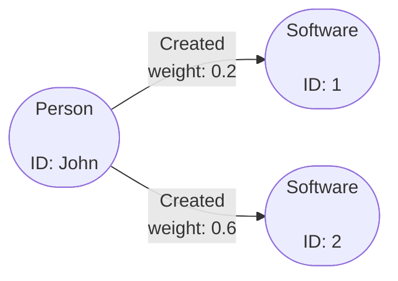

# Gremlin in Gaffer

!!! warning
    GafferPop is still under development and has some [limitations](gremlin-limits.md).
    The implementation may not allow some advanced features of Gremlin and it's
    performance is unknown in comparison to standard Gaffer `OperationChains`.

[Gremlin](https://tinkerpop.apache.org/gremlin.html) is a query language for
traversing graphs. It is a core component of the Apache Tinkerpop library and
allows users to easily express more complex graph queries.

GafferPop is a lightweight Gaffer implementation of the [TinkerPop framework](https://tinkerpop.apache.org/),
where TinkerPop methods are delegated to Gaffer graph operations.

The addition of Gremlin as query language in Gaffer allows users to represent
complex graph queries in a simpler language akin to other querying languages
used in traditional and NoSQL databases. It also has wide support for various
languages so for example, you can write queries in Python via the [`gremlinpython` library](https://pypi.org/project/gremlinpython/)

!!! tip
    In-depth tutorials on Gremlin as a query language and its associated libraries
    can be found in the [Apache Tinkerpop Gremlin docs](https://tinkerpop.apache.org/gremlin.html).

## Using Gremlin Queries in Gaffer

Gremlin was added to Gaffer in version 2.1 as a new graph query language and since
version 2.2 a container image is provided allowing a Gremlin layer to be added to
existing 2.x graphs. A full tutorial on setting up this image is provided in the
[administration guide](../../../administration-guide/gaffer-deployment/gremlin.md).

This guide will use the [Python API for Gremlin](https://pypi.org/project/gremlinpython/)
to demonstrate some basic capabilities and how they compare to standard Gaffer syntax.

To start querying in Gremlin we first need a reference to what is known as the
Graph Traversal. To obtain this we need to connect to a running Gremlin server,
similar to how a connection to the Gaffer REST API is needed if using
[`gafferpy`](../../apis/python-api.md). We can do this by first importing the required
libraries like so (many of these will be needed later for queries):

```python
from gremlin_python.process.anonymous_traversal import traversal
from gremlin_python.driver.driver_remote_connection import DriverRemoteConnection
from gremlin_python.process.graph_traversal import __
```

We can then establish a connection to the Gremlin server and save a reference to
this (typically called `g`):

```python
# Setup a connection with the gremlin server running on localhost
g = traversal().with_remote(DriverRemoteConnection('ws://localhost:8182/gremlin', 'g'))
```

Now that we have the traversal reference this can be used to spawn graph traversals
and get results back.

### Basic Gremlin Queries

Gremlin queries (similar to Gaffer queries) usually require a starting set of
entities to query from. Commonly Gremlin queries will be left without any IDs in
the starting seed which would be analogous to asking for all vertexes with
`g.V()` or, all edges with `g.E()`. However, if this type of query is used with
the Gafferpop library this will in effect call a `GetAllElements` operation which
is less than ideal. Its therefore, highly recommended to always seed the query with
IDs.

We will use the following graph to demonstrate the basic usage of gremlin compared
to Gaffer.



!!! example ""
    Now say we wanted to get all the vertexes connected from the `Person`
    vertex `"John"` via a `Created` edge (essentially all the things `"John"`
    has created):

    === "Gremlin"

        Gremlin is 'lazy' so will only execute your query if you request it
        to by using a `to_list()` or calling `next()` on the iterator.

        ```python
        # We seed with "John" and traverse over any "Created" out edges
        g.V("John").out("Created").element_map().to_list()
        ```

        Result:

        ```text
        [{<T.id: 1>: '1', <T.label: 4>: 'Software'}]
        [{<T.id: 1>: '2', <T.label: 4>: 'Software'}]
        ```

    === "Gaffer JSON"

        Note standard Gaffer you must know the group of the target vertexes you
        want returned otherwise edges will be also present in the result.

        ```JSON
        {
            "class": "OperationChain",
            "operations": [
                {
                    "class": "GetAdjacentIds",
                    "input": [
                        {
                            "class": "EntitySeed",
                            "vertex": "John"
                        }
                    ],
                    "view": {
                        "edges": {
                            "Created": {}
                        }
                    }
                },
                {
                    "class": "GetElements",
                    "view": {
                        "entities": {
                            "Software": {}
                        }
                    }
                }
            ]
        }
        ```

        Result:

        ```JSON
        [
            {
                "class": "uk.gov.gchq.gaffer.data.element.Entity",
                "group": "Software",
                "vertex": 1
            },
            {
                "class": "uk.gov.gchq.gaffer.data.element.Entity",
                "group": "Software",
                "vertex": 2
            }
        ]
        ```

As you can see the Gremlin query is quite a bit easier to write and
provides the results in a handy output to be reused. Now say if you wanted
to apply some filtering on the same graph, the following is an example
of how Gremlin handles this:

!!! example ""
    Get all the `Created` edges from vertex `"John"` that have a `"weight"`
    greater than 0.4:

    === "Gremlin"

        ```python
        # If needed we run this through an 'element_map()' call to get more info on the edge
        g.V("John").outE("Created").has("weight", P.gt(0.4)).to_list()
        ```

        Result:

        ```text
        [e[['John', 2]][John-Created->2]]
        ```

    === "Gaffer JSON"

        ```JSON
        {
            "class": "GetElements",
            "input": [
                {
                    "class": "EntitySeed",
                    "vertex": "John"
                }
            ],
            "view": {
                "edges": {
                    "Created": {
                        "preAggregationFilterFunctions": [
                            {
                                "selection": [
                                    "weight"
                                ],
                                "predicate": {
                                    "class": "IsMoreThan",
                                    "orEqualTo": false,
                                    "value": {
                                        "Float": 0.4
                                    }
                                }
                            }
                        ]
                    }
                }
            }
        }
        ```

        Result:

        ```JSON
        [
            {
                "class": "uk.gov.gchq.gaffer.data.element.Edge",
                "group": "Created",
                "source": "John",
                "destination": "2",
                "directed": true,
                "matchedVertex": "SOURCE",
                "properties": {
                    "weight": 0.6
                }
            }
        ]
        ```

There are more example queries to be found in the [Gremlin Getting Started](https://tinkerpop.apache.org/docs/current/tutorials/getting-started/) docs.

## Mapping Gaffer to TinkerPop

Some of the terminology is slightly different between TinkerPop and Gaffer,
a table of how different parts are mapped is as follows:

| Gaffer | TinkerPop |
| --- | --- |
| Group | Label |
| Vertex | Vertex with default label of `id` |
| Entity | Vertex |
| Edge | Edge |

In Gafferpop Edge ID's must be made up of a list containing either source and destination
IDs, e.g. `[source, dest]`, or source, label and destination, e.g. `[source, label, dest]`.
In a seeded query these should be formatted like so `g.E("[source, dest]")` or
`g.E(["[source1, dest1]","[source2, label, dest2]"])`.

Note that if using TypeSubTypeValue for seeds or property values these must be in the
format `t:type|st:subtype|v:value`.

## Custom Features

The GafferPop implementation provides some extra features on top of the
standard Tinkerpop framework that you can utilise in your queries. These
are likely specific to how a Gaffer graph operates and may not be available
in other graph technologies that support Gremlin queries.

### NamedOperations in Gremlin

The [GafferPopNamedOperationService](https://gchq.github.io/Gaffer/uk/gov/gchq/gaffer/tinkerpop/service/GafferPopNamedOperationService.html)
allows for the running of Gaffer [Named Operations](../../../administration-guide/named-operations.md) using Tinkerpop.
Users can run Named Operations and add new Named Operations, deleting Named Operations is not currently possible with Tinkerpop.

!!! example ""
    Add a simple Named Operation that returns a count of all elements in your graph.

    === "Gremlin"

        ```python
        operation = gc.OperationChain(
            operations=[
                gc.GetAllElements(),
                gc.Count()
            ]
        ).to_json_str()

        params = {"add": {"name": "CountAllElements", "opChain": operation}}

        g.call("namedoperation", params)
        ```

    === "Java"

        ```java
        final AddNamedOperation operation = new AddNamedOperation.Builder()
            .operationChain(new OperationChain.Builder()
                .first(new GetAllElements()
                        .then(new Count<>())
                        .build())
                .build())
            .name("CountAllElements")
            .build();

        Map<String, String> addParams = new HashMap<>();
        addParams.put("name", "CountAllElements");
        addParams.put("opChain", operation.getOperationChainAsString());
        Map<String, Map <String, String>> params = Collections.singletonMap("add", addParams);

        g.call("namedoperation", params);
        ```

Users can also run any existing or added Named Operations that are stored in the cache.

!!! example ""

    === "Gremlin"

        ```python
        g.call("namedoperation", {"execute": "CountAllElements"}).to_list()
        ```

    === "Java"

        ```java
        Map<String, String> params = Collections.singletonMap("execute", "CountAllElements")
        g.call("namedoperation", params).toList();
        ```

### Adding Options to Queries

In standard Gremlin syntax it is possible to add additional key value variables
into a query via a [`with()` step](https://tinkerpop.apache.org/docs/current/reference/#with-step).
This feature is utilised to allow some custom properties to be passed in
for Gaffer specific options:

| Key | Example | Description |
| --- | --- | --- |
| `operationOptions` | `g.with("operationOptions", "gaffer.federatedstore.operation.graphIds:graphA").V()` | Allows passing options to the underlying Gaffer Operations, this is the same as the `options` field on a standard JSON query. |
| `getAllElementsLimit` | `g.with("getAllElementsLimit", 100).V()` | Limits the amount of elements returned if performing an unseeded query e.g. a `GetAllElements` operation. |
| `hasStepFilterStage` | `g.with("hasStepFilterStage", "PRE_AGGREGATION").V()` | Controls which phase the filtering from a Gremlin `has()` stage is applied to the results. |
