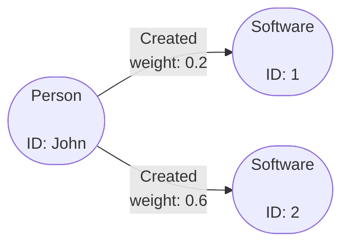
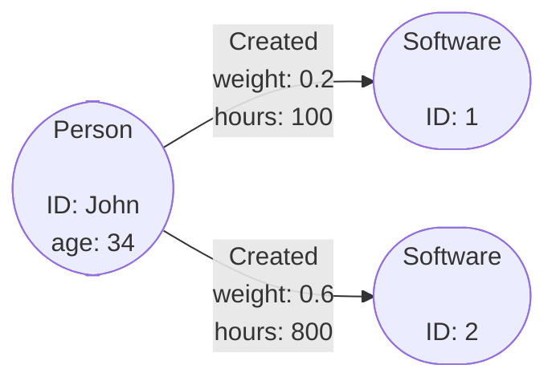

# Filtering Data

One of the key parts of querying data is being able to filter bits out you may
not want. This page will cover some of the common ways you can filter the
returned data from an Operation to get the data you want.

In Gaffer the main way you filter data is by applying whats known as a `View` to
a returned set of elements. A `View` as the name suggests, allows you to view
the data in a different way this can be either via a filter, aggregation,
transformation or just general manipulation of the results.

Use cases with a `View` usually fall into one of the following catagories:

- **Filtering** - General filtering on elements based on predicates. Filtering
    can be applied pre-aggregation, post aggregation and post transformation.

- **Aggregation** - This is to control how similar elements are aggregated
    together. You can provide a subset of the schema `groupBy` properties and
    override existing aggregation functions.

- **Transformation** - Transformations can be applied by providing Functions to
    transform properties and vertex values. This is a powerful feature, you can
    override the existing values or you can transform and save the new value
    into a new transient property.

- **Property Removal** - The relevant properties you want to be returned can be
    controlled. You can use either `properties` or `excludeProperties` to define
    the list of properties to be included or excluded.

## Filtering in Practice

We will demonstrate general filtering on a query. Take the following graph as a
basic example, where we have a `Person` node with ID `John` that has a few
`Created` edges with a `weight` property on them.



Now say the `weight` property could represent how much a `Person` contributed to
creating something, and so we wanted to find only significant contributions. To
do this we can apply a filter to act as a threshold to only get edges with a
`weight` more than a specific value.

First we use a simple query to get the node with ID `John` and any edges
associated with it. Then we can apply a filter to include only edges where the
`weight` property is over a certain value.

!!! example ""
    In this scenario it is analogous to asking, *"Get all the `Created` edges on
    node `John` that have a `weight` greater than 0.4"*.

    ```json
    {
        "class": "GetElements",
        "input": [
            {
                "class": "EntitySeed",
                "vertex": "John"
            }
        ],
        "view": {
            "edges": {
                "Created": {
                    "preAggregationFilterFunctions": [
                        {
                            "selection": [
                                "weight"
                            ],
                            "predicate": {
                                "class": "IsMoreThan",
                                "orEqualTo": false,
                                "value": {
                                    "Float": 0.4
                                }
                            }
                        }
                    ]
                }
            }
        }
    }
    ```

!!! tip
    As you can see filtering is based around predicates which are similar to if
    else statements in traditional programming. For a full list of available
    predicates refer to the [reference documentation](../../../reference/predicates-guide/predicates.md).

### Filtering Properties

If you are only interested in specific properties then it is more efficient to
tell Gaffer to only return those properties. This can be easily achieved by
applying the `properties` or `excludeProperties` field to a `View`.

If we take a similar example as before but instead add a couple of properties
to both the `Person` and `Created` elements to give a graph like the following:



Now as before we can run a query on this graph to get the elements relevant to
the `Person` node however, this time we will filter so that only specific
properties are returned.

!!! example ""
    Here we are asking to only include the `hours` property from the `Created`
    edges in the output, and specifically excluding the `age` property from any
    returned `Person` entities.

    ```json
    {
        "class": "GetElements",
        "input": [
            {
                "class": "EntitySeed",
                "vertex": "John"
            }
        ],
        "view": {
            "edges": {
                "Created": {
                    "properties" : [ "hours" ]
                }
            },
            "entities" : {
                "Person" : {
                    "excludeProperties" : [ "age" ]
                }
            }
        }
    }
    ```

## Transformation

Its possible to apply a transformation to the output of a query this gives you
an opportunity to manipulate the results into a more useful output.

When a transform is applied the new results are save into whats known as a
transient property. A transient property is just a property that is not
persisted, simply created at query time by a transform function.

To use a transform you must use a transform function, this is a Java class
that extends the [`java.util.Function`](https://docs.oracle.com/javase/8/docs/api/java/util/function/Function.html)
class to take some input and give a new output. Commonly you would want to
write your own transform function class as it can be quite specific to your
graph data and what analytics you want to get out of it. However, there is
the [Koryphe module](../../../reference/functions-guide/koryphe-functions.md)
that is included by default with Gaffer which provides a some default functions
you can make use of.

As an example of transformation we will use the same graph from the [previous
section](#filtering-properties) to transform the `hours` property into minutes
and save the returned information into a new `minutes` transient property.

!!! example ""
    Here you can see we select the inputs for the function as the `"hours"`
    property we then use the `MultiplyBy` Koryphe function to transform property
    and project the result into a transient property named `"minutes"`.

    ```json
    {
        "class": "GetElements",
        "input": [
            {
                "class": "EntitySeed",
                "vertex": "John"
            }
        ],
        "view": {
            "edges": {
                "Created": {
                    "transientProperties" : {
                        "minutes" : "java.lang.Integer"
                    },
                    "transformFunctions" : [
                        {
                            "selection" : [ "hours" ],
                            "function" : {
                                "class" : "MultiplyBy",
                                "by" : 60
                            },
                            "projection" : [ "minutes" ]
                        }
                    ]
                }

            }
        }
    }
    ```

The `selection` in a transform is similar to the way we select properties and
identifiers in a filter, and as demonstrated you can select (and also project)
any property but also or any of these unique identifiers:

- `VERTEX` - This is the vertex on an Entity.
- `SOURCE` - This is the source vertex on an Edge.
- `DESTINATION` - This is the destination vertex on an Edge.
- `DIRECTED` - This is the directed field on an Edge.
- `MATCHED_VERTEX` - This is the vertex that was matched in the query, either
  the `SOURCE` or the `DESTINATION`.
- `ADJACENT_MATCHED_VERTEX` - This is the adjacent vertex that was matched in
  the query, either the `SOURCE` or the `DESTINATION`. For example, if your seed
  matches the source of the edge This would resolve to the `DESTINATION` value.

## Aggregation

!!! warning
    TODO: Overview of applying aggregation in a query

