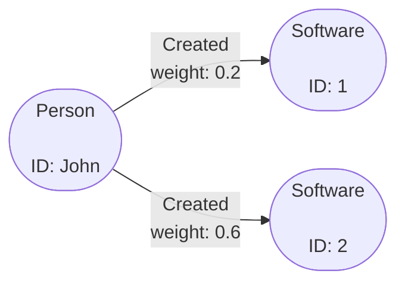

# Filtering Data

One of the key parts of querying data is being able to filter bits out you may
not want. This page will cover some of the common ways you can filter the
returned data from an Operation to get the data you want.

In Gaffer the main way you filter data is by applying whats known as a `View` to
a returned set of elements. A `View` as the name suggests, allows you to view
the data in a different way this can be either via a filter, aggregation,
transformation or just general manipulation of the results.

Use cases with a `View` usually fall into one of the following catagories:

- **Filtering** - General filtering on elements based on predicates. Filtering
    can be applied pre-aggregation, post aggregation and post transformation.

- **Aggregation** - This is to control how similar elements are aggregated
    together. You can provide a subset of the schema `groupBy` properties and
    override existing aggregation functions.

- **Transformation** - Transformations can be applied by providing Functions to
    transform properties and vertex values. This is a powerful feature, you can
    override the existing values or you can transform and save the new value
    into a new transient property.

- **Property Removal** - The relevant properties you want to be returned can be
    controlled. You can use either `properties` or `excludeProperties` to define
    the list of properties to be included or excluded.

## Filtering in Practice

We will demonstrate general filtering on a query. Take the following graph as a
basic example, where we have a `Person` node with ID `John` that has a few
`Created` edges with a `weight` property on them.



Now say the `weight` property could represent how much a `Person` contributed to
creating something, and so we wanted to find only significant contributions. To
do this we can apply a filter to act as a threshold to only get edges with a
`weight` more than a specific value.

First we use a simple query to get the node with ID `John` and any edges
associated with it. Then we can apply a filter to include only edges where the
`weight` property is over a certain value.

!!! example ""
    In this scenario it is analogous to asking, *"Get all the `Created` edges on
    node `John` that have a `weight` greater than 0.4"*.

    ```json
    {
        "class": "GetElements",
        "input": [
            {
                "class": "EntitySeed",
                "vertex": "John"
            }
        ],
        "view": {
            "edges": {
                "Created": {
                    "preAggregationFilterFunctions": [
                        {
                            "selection": [
                                "weight"
                            ],
                            "predicate": {
                                "class": "IsMoreThan",
                                "orEqualTo": false,
                                "value": {
                                    "Float": 0.4
                                }
                            }
                        }
                    ]
                }
            }
        }
    }
    ```

!!! tip
    As you can see filtering is based around predicates which are similar to if
    else statements in traditional programming. For a full list of available
    predicates refer to the [reference documentation](../../reference/predicates-guide/predicates.md).

### Filtering Properties

If you are only interested in specific properties then it is more efficient to
tell Gaffer to only return those properties. This can be easily achieved by
applying the `properties` or `excludeProperties` field to a `View`.

If we take a similar example as before but instead add a couple of properties
to both the `Person` and `Created` elements to give a graph like the following:


Now as before we can run a query on this graph to get the elements relevant to
the `Person` node however, this time we will filter so that only specific
properties are returned.

!!! example ""
    Here we are asking to only include the `hours` property from the `Created`
    edges in the output, and specifically excluding the `age` property from any
    returned `Person` entities.

    ```json
    {
        "class": "GetElements",
        "input": [
            {
                "class": "EntitySeed",
                "vertex": "John"
            }
        ],
        "view": {
            "edges": {
                "Created": {
                    "properties" : [ "hours" ]
                }
            },
            "entities" : {
                "Person" : {
                    "excludeProperties" : [ "age" ]
                }
            }
        }
    }
    ```

## Transformation

!!! warning
    TODO: Overview of applying transformation to a query

## Aggregation

!!! warning
    TODO: Overview of applying aggregation in a query

